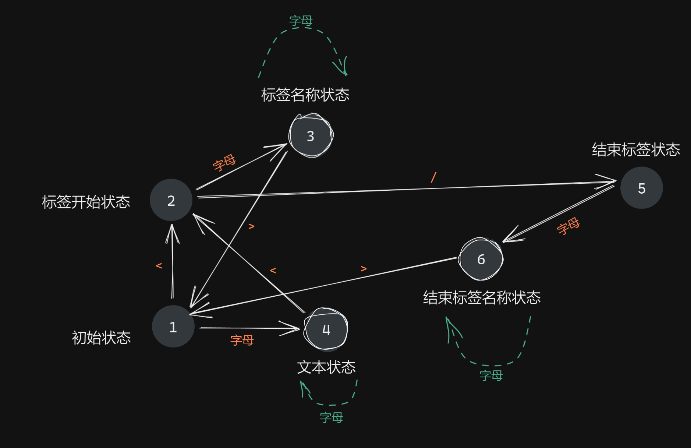
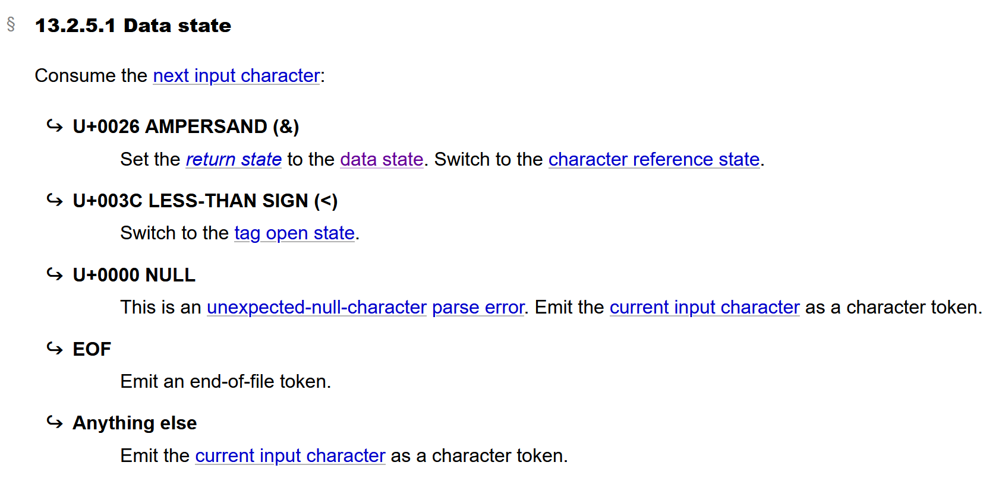
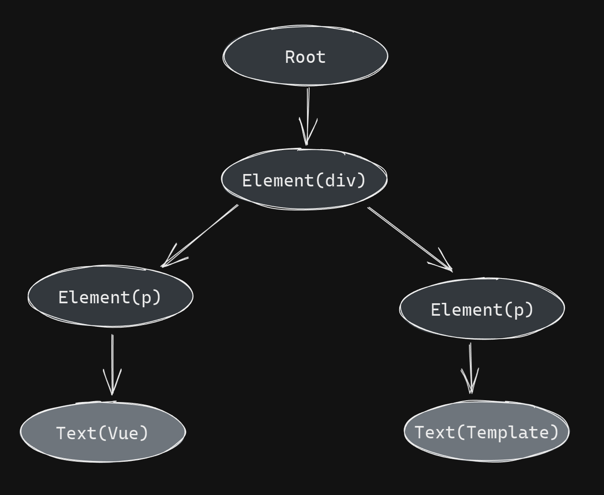
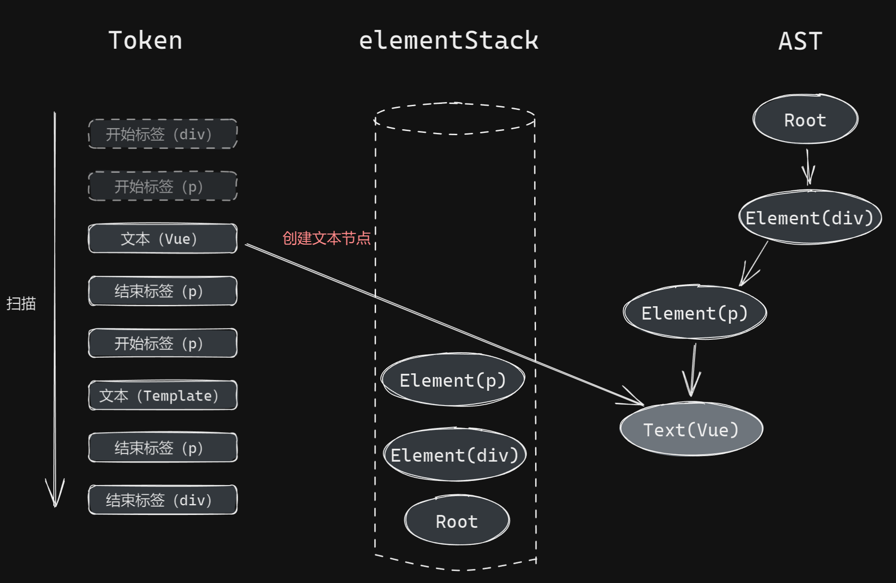
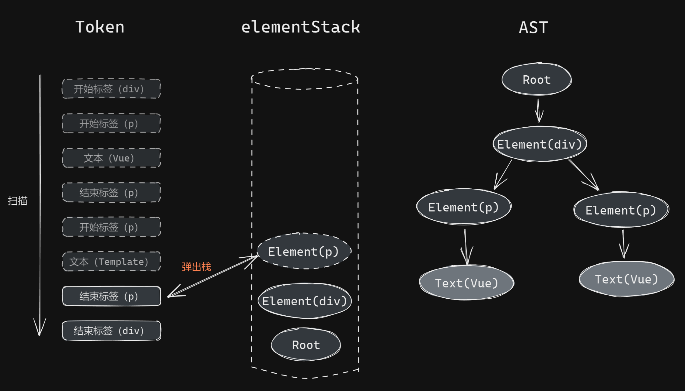
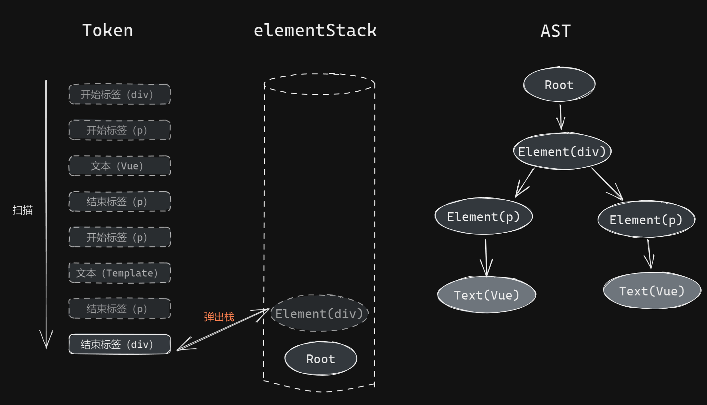
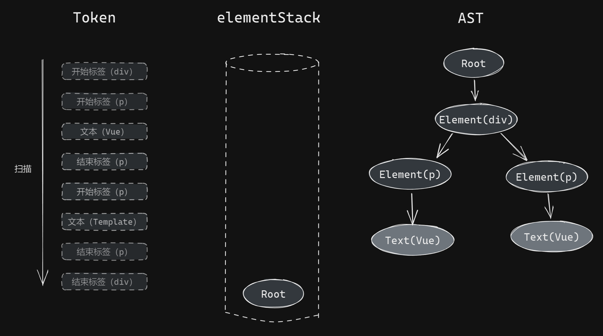
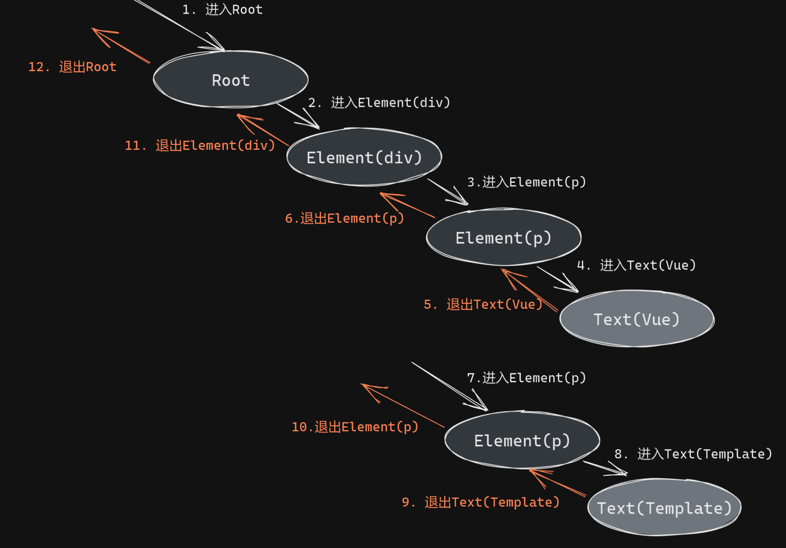

# 编译器核心技术概览

作为前端工程师，我们应用编译技术的场景通常是：表格、报表中的自定义公式计算器，设计一种领域特定语言（DSL）等。其中，实现公式计算器甚至只涉及编译前端技术，而领域特定语言根据其具体使用场景和目标平台不同，难度会有所不同。Vue.js 的模板和 JSX 都属于特定语言，它们实现难度属于中、低级别，只要掌握基本的编译技术理论即可实现这些功能。

## 模板 DSL 的编译器

编译器其实只是一段程序，它用来将 “一种语言 A” 翻译成 “另一种语言 B”。其中，语言 A 通常叫作**源代码（source code）**，语言 B 通常叫作**目标代码（object code 或 target code）。**编译器将源代码翻译为目标代码的过程叫作编译（compile）。完整的编译过程通常包括词法分析、语法分析、语义分析、中间代码生成、优化、目标代码生成等步骤，如下图所示：


可以看到，整个编译过程分为编译前端和编译后端。编译前端包含词法分析、语法分析和语义分析，它通常与目标平台无关，仅负责分析源代码。编译后端包含中间代码生成、优化和目标代码生成，通常与目标平台有关。但是，编译后端并不一定包含中间代码生成和优化两个环节，这取决于具体的场景和实现。中间代码生成和优化这两个环节有时也叫 “中端”。

上图展示了 “教科书” 式的编译模型。但 Vue.js 的模板作为 DSL，其编译流程会有所不同。对于 Vue.js 模板编译器来说，源代码就是组件的模板，而目标代码是能够在浏览器平台上运行的 JavaScript 代码，或其他拥有 JavaScript 运行时的平台代码，如下图所示：


可以看到，Vue.js 模板编译器的目标代码其实就是渲染函数。详细而言，Vue.js 模板编译器会首先对模板进行词法分析和语法分析，得到模板 AST。接着，将模板 AST **转换（tranform）**成 JavaScript AST。最后，根据 JavaScript AST 生成 JavaScript 代码，即渲染函数代码。下图给出了 Vue.js 模板编译器的工作流程：


AST 是 abstract syntax tree 的首字母缩写，即抽象语法树。所谓模板 AST，其实就是用来描述模板的抽象语法树。举个例子，假设我们有如下模板：

```html
<div>
  <h1 v-if="ok">
   	Vue Template
  </h1>
</div>
```

这段模板会被编译成如下所示的 AST：

```js
const ast = {
  // 逻辑根节点
  type: 'Root',
  children: [
    // div 标签节点
    {
      type: 'Element',
      tag: 'div',
      children: [
        // h1 标签节点
        {
          type: 'Element',
          tag: 'h1',
          props: [
            // v-if 指令节点
            {
              type: 'Directive', // 类型为 Directive 代表指令
              name: 'if', // 指令名称为 if，不带有前缀 v-
              exp: {
                // 表达式节点
                type: 'Expression',
                content: 'ok'
              }
            }
          ]
        }
      ]
    }
  ]
}
```

可以看到，AST 其实就是一个具有层级结构的对象。模板 AST 具有与模板同构的嵌套结构。每一棵 AST 都有一个逻辑上的根节点，其类型为 Root。模板中真正的根节点则作为 Root 节点的 children 存在。观察上面的 AST，我们可以得出如下结论：

+ 不同类型的节点是通过节点的 type 属性进行区分的。例如标签节点的 type 值为 Element；
+ 标签节点的子节点存储在其 children 数组中；
+ 标签节点的属性节点和指令节点会存储在 props 数组中；
+ 不同类型的节点会使用不同的对象属性进行描述。例如指令节点拥有 name 属性，用来表达指令的名称，而表达式节点拥有 content 属性，用来描述表达式的内容。

我们可以通过封装 `parse()` 函数来完成对模板的词法分析和语法分析，得到模板 AST，如下图所示：


我们也可以用下面的代码来表达模板解析的过程：

```js
const template = `
  <div>
    <h1 v-if="ok">Vue Template</h1>
  </div>
`

const templateAST = parse(template)
```

可以看到，`parse()` 函数接收字符串模板作为参数，并将解析后得到的 AST 作为返回值返回。

有了模板 AST 后，我们就可以对其进行语义分析，并对模板 AST 进行转换了。什么是语义分析呢？举几个例子：

+ 检查 v-else 指令是否存在相符的 v-if 指令；
+ 分析属性值是否是静态的，是否是常量等；
+ 插槽是否会引用上层作用域的变量；
+ ......

在语义分析的基础上，我们即可得到模板 AST。接着，我们还需要将模板 AST 转换为 JavaScript AST。因为 Vue.js 模板编译器的最终目标是生成渲染函数，而渲染函数本质上是 JavaScript 代码，所以我们需要将模板 AST 转换成用于描述渲染函数的 JavaScript AST。

我们可以封装 `transform()` 函数来完成模板 AST 到 JavaScript AST 的转换工作，如下图所示：


同样，我们可以用下面的代码来表达：

```js
const templateAST = parse(template)
const jsAST = transform(templateAST)
```

有了 JavaScript AST 之后，我们就可以根据它生成渲染函数了，如下图所示：


我们也可以用下面的代码来表达代码生成的过程：

```js
const templateAST = parse(template)
const jsAST = transform(templateAST)
const code = generate(jsAST)
```

在上面这段代码中，`generate()` 函数会将渲染函数的代码以字符串的形式返回，并存储在 code 常量中。下图给出完整的流程：


## parser 的实现原理与状态机

上面，我们讲解了 Vue.js 模板编译器的基本结构和工作流程，它主要由三个部分组成：

1. 用来将模板字符串解析为模板 AST 的解析器（parser）；
2. 用来将模板 AST 转换为 JavaScript AST 的转换器（transformer）；
3. 用来根据 JavaScript AST 生成渲染函数代码的生成器（generator）。

接下来，我们将详细讨论解析器 parser 的实现原理。

解析器的入参是字符串模板，解析器会逐个读取字符串中的字符，并根据一定的规则将整个字符串切割为一个个 Token。这里的 Token 可以视作为词法记号，后续我们将使用 Token 一词来代表词法记号进行讲解。举例来说，假设有这样一段模板：

```html
<p>Vue</p>
```

解析器会把这段字符串模板切割为三个 Token：

+ 开始标签：`<p>`；
+ 文本节点：Vue；
+ 结束标签：`</p>`。

那么，解析器是如何对模板进行切割的呢？依据什么规则？这就不得不提到有限状态自动机了。千万不要被这个名词吓到，它理解起来并不难。

所谓 “有限状态”，就是指有限个状态，而 “自动机” 意味着随着字符的输入，解析器会自动地在不同状态间迁移。拿上面的模板来说，当我们分析这段模板字符串时，`parse()` 函数会逐个读取字符，状态机会有一个初始状态，我们记为 “初始状态 1”。下图给出了状态迁移的过程：



我们用自然语言来描述上图给出的状态迁移过程：

1. 状态机始于 “初始状态 1”；
2. 在 “初始状态 1” 下，读取模板的第一个字符 `<`，状态机会进入下一个状态，即 “标签开始状态 2”；
3. 在 “标签开始状态 2” 下，读取下一个字符 `p`。由于字符 `p` 是字母，所以状态机会进入 “标签名称状态 3”；
4. 在 “标签名称状态 3” 下，读取下一个字符 `>`，此时状态机会从 “标签名称状态 3” 迁移回 “初始状态 1”，并记录在 “标签名称状态” 下产生的标签名称 `p`；
5. 在 “初始状态 1” 下，读取下一个字符 `V`，此时状态机会进入 “文本状态 4”；
6. 在 “文本状态 4” 下，继续读取后续字符，直到遇到字符 `<` 时，状态机会再次进入 “标签开始状态 2”，并记录在 “文本状态 4” 下产生的文本内容，即字符串 `Vue`；
7. 在 “标签开始状态 2” 下，读取下一个字符 `/`，状态机会进入 “结束标签状态 5”；
8. 在 “结束标签状态 5” 下，读取下一个字符 `p`，状态机会进行 “结束标签名称状态 6”；
9. 在 “结束标签名称状态 6” 下，读取最后一个字符 `>`，它是结束标签的闭合字符，于是状态机迁移回 “初始状态 1”，并记录在 “结束标签名称状态 6” 下生成的结束标签名称。

经过这样一系列的状态移动过程之后，我们最终就能够得到相应的 Token 了。我们观察上图可以发现，有的圆圈是单线的，而有的圆圈是双线的。双线代表此时状态机是一个合法的 Token。

另外，上图给出的状态机并不严谨。实际上，解析 HTML 并构造 Token 的过程是有规范可循的。在 WHATWG 发布的关于浏览器解析 HTML 的规范中，详细阐述了状态迁移。下图截取了该规范中定义在 “初始状态” 下状态机的状态迁移过程：



可以看到，在 “初始状态” （Data State）下，当遇到字符 `<` 时，状态机会迁移到 `tag open state`，即 ”标签开始状态“。如果遇到字符 `<` 以外的字符，规范中也都有对应的说明，应该让状态机迁移到怎样的状态。不如 Vue.js 的模板作为一个 DSL，并非必须遵守该规范。但 Vue.js 的模板毕竟是类 HTML 的实现，因此尽可能按照规范来做，不会有什么坏处。更重要的一点是，规范中已经定义了非常详细的状态迁移过程，这对于我们编写解析器非常有帮助。

按照有限状态自动机的状态迁移过程，我们可以很容易地编写对应的代码实现。因此，有限状态自动机可以帮助我们完成对模板的**标记化（tokenized）**，最终我们将得到一系列 Token。上面图中描述的状态机的实现如下：

```js
// 定义状态机的状态
const State = {
  initial: 1,     // 初始状态
  tagOpen: 2,     // 标签开始状态
  tagName: 3,     // 标签名称状态
  text: 4,        // 文本状态
  tagEnd: 5,      // 结束标签状态
  tagEndName: 6   // 结束标签名称状态
}

// 辅助函数，用于判断是否是字符
const isAlpha = char => char >= 'a' && char <= 'z' || char >= 'A' && char <= 'Z'

// 接收模板字符串作为参数，并将模板切割为 Token 返回
function tokenize (str) {
  // 状态机的当前状态：初始状态
  let currentState = State.initial
  // 用于缓存字符
  const chars = []
  // 生成的 Token 会存储到 tokens 数组中，并作为函数的返回值返回
  const tokens = []

  // 使用 while 循环开启自动机，只要模板字符串没有被消费完，自动机就会一直运行
  while (str) {
    // 查看第一个字符，注意，这里只是查看，没有消费该字符
    const char = str[0]

    switch (currentState) {
      // 状态机当前处于初始状态
      case State.initial:
        // 遇到字符 '<'
        if (char === '<') {
          // 1. 状态机切换到标签开始状态
          currentState = State.tagOpen
          // 2. 消费字符 '<'
          str = str.slice(1)
        } else if (isAlpha(char)) {
          // 1. 遇到字母，切换到文本状态
          currentState = State.text
          // 2. 将当前字母缓存到 chars 数组
          chars.push(char)
          // 3. 消费当前字符
          str = str.slice(1)
        }
        break
      // 状态机当前处于标签开始状态
      case State.tagOpen:
        if (isAlpha(char)) {
          // 1. 遇到字母，切换到标签名称状态
          currentState = State.tagName
          // 2. 将当前字母缓存到 chars 数组
          chars.push(char)
          // 3. 消费当前字符
          str = str.slice(1)
        } else if (char === '/') {
          // 1. 遇到字符 /，切换到结束标签状态
          currentState = State.tagEnd
          // 2. 消费字符 /
          str = str.slice(1)
        }
        break
      // 状态机当前处于标签名称状态
      case State.tagName:
        if (isAlpha(char)) {
          // 1. 遇到字母，由于当前处理标签名称状态，所以不需要切换状态，
          // 但需要将当前字符缓存到 chars 数组中。
          chars.push(char)
          // 2. 消费当前字符
          str = str.slice(1)
        } else if (char === '>') {
          // 1. 遇到字符 '>'，切换到初始状态
          currentState = State.initial
          // 2. 同时创建一个标签 Token，并添加到 tokens 数组中
          // 注意，此时 chars 中的字符就是标签名称
          tokens.push({
            type: 'tag',
            name: chars.join('')
          })
          // 3. chars 数组的内容已经被消费，清空它
          chars.length = 0
          // 4. 同时消费当前字符 '>'
          str = str.slice(1)
        }
        break
      // 状态机当前处于文本状态
      case State.text:
        if (isAlpha(char)) {
          // 1. 遇到字母，保持状态不变，但应该将当前字符缓存到 chars 数组中
          chars.push(char)
          // 2. 消费当前字符
          str = str.slice(1)
        } else if (char === '<') {
          // 1. 遇到字符 '<'，切换到标签开始状态
          currentState = State.tagOpen
          // 2. 从 文本状态 ---> 标签开始状态，此时应该创建文本 Token，并添加到 tokens 数组中
          // 注意，此时 chars 数组中的字符就是文本内容
          tokens.push({
            type: 'text',
            content: chars.join('')
          })
          // 3. chars 数组的内容已经被消费，清空它
          chars.length = 0
          // 4. 同时消费当前字符 '<'
          str = str.slice(1)
        }
        break
      // 状态机处于标签结束状态
      case State.tagEnd:
        if (isAlpha(char)) {
          // 1. 遇到字母，切换到结束标签名称状态
          currentState = State.tagEndName
          // 2. 将当前字符缓存到 chars 数组中
          chars.push(char)
          // 3. 消费当前字符
          str = str.slice(1)
        }
        break
      // 状态机当前牌结束标签名称状态
      case State.tagEndName:
        if (isAlpha(char)) {
          // 1. 遇到字母，不需要切换状态，但需要将当前字符缓存到 chars 数组中
          chars.push(char)
          // 2. 消费当前字符
          str = str.slice(1)
        } else if (char === '>') {
          // 1. 遇到字符 '>'，切换到初始状态
          currentState = State.initial
          // 2. 从 结束标签名称状态 ---> 初始状态，应该保存结束标签名称 Token
          // 注意，此时 chars 数组中缓存的内容就是标签名称
          tokens.push({
            type: 'tagEnd',
            name: chars.join('')
          })
          // 3. chars 数组的内容已经被消费，清空它
          chars.length = 0
          // 4. 消费当前字符
          str = str.slice(1)
        }
        break
      default:
        break
    }
  }

  // 最后，返回 tokens
  return tokens
}
```

上面这段代码看上去比较冗长，可优化的点非常多。这段代码高度还原了前图展示的状态机，配合代码中的注释会更容易理解。

使用上面给出的 `tokenize()` 函数来解析模板 `<p>Vue</p>`，我们将得到三个 Token：

```js
const tokens = tokenize(`<p>Vue</p>`)
console.log(tokens)
// [
//   {
//     "type": "tag",
//     "name": "p"
//   },
//   {
//     "type": "text",
//     "content": "Vue"
//   },
//   {
//     "type": "tagEnd",
//     "name": "p"
//   }
// ]
```

现在，你已经明白了状态机的工作原理，以及模板编译器将模板字符串切割为一个个 Token 的过程。但拿上述例子来说，我们并非总是需要所有 Token。例如，在解析模板的过程中，结束标签 Token 可以省略。这时，我们就可以调整 `tokenize()` 函数的代码，并选择性地忽略结束标签 Token。当然，有时我们也可能需要更多的 Token，这都取决于具体的需求，然后灵活地调整代码实现。

总而言之，通过有限状态自动机，我们能够将模板解析为一个个 Token，进而可以用它们构建一棵 AST 了。但在具体构建 AST 之前，我们需要思考能否简化 `tokenize()` 函数的代码？实际上，我们可以通过正则表达式来精简 `tokenize()` 函数的代码。上文之所以没有从最开始就采用正则表达式来实现，是因为**正则表达式的本质就是有限状态自动机。**当你在编写正则表达式的时候，其实就是在编写有限状态自动机。

## 构造 AST

实际上，不同 用途的编译器之间可能会存在非常大的差异。它们唯一的共同点是，都会将源代码转换成目标代码。但如果深入细节即可发现，不同编译器之间的实现思路甚至可能完全不同，其中就包括 AST 的构造方式。对于通用用途语言（GPL）来说，例如 JavaScript 这样的脚本语言，想要为其构造 AST，较常用的一种算法叫作*递归下降算法*，这里面需要解决 GPL 层面才会遇到的很多问题，例如最基本的运算符优先级问题。然而，对于像 Vue.js 模板这样的 DSL 来说，首先可以确定的一点是，它不具有运算符，所以也就没有所谓的运算符优化级问题。DSL 与 GPL 的区别在于，GPL 是图灵完备的，我们可以使用 GPL 来实现 DSL。而 DSL 不要求图灵完备，它只需要满足特定场景下的特定用途即可。

为 Vue.js 的模板构造 AST 是一件很简单的事。HTML 是一种标记语言，它的格式非常固定，标签元素之间天然嵌套，形成父子关系。因此，一棵用于描述 HTML 的 AST 将拥有与 HTML 标签非常相似的树型结构。举例来说，假设有如下模板：

```html
<div>
  <p>Vue</p>
  <p>Template</p>
</div>
```

在上面这段模板中，最外层的根节点是 div 标签，它有两个 p 标签作为子节点。同时，这两个 p 标签都具有一个文本节点作为子节点。我们可以将这段模板对应的 AST 设计为：

```js
const ast = {
  type: 'Root',
  children: [
    {
      type: 'Element',
      tag: 'div',
      children: [
        {
          type: 'Element',
          tag: 'p',
          children: [
            {
              type: 'Text',
              content: 'Vue'
            }
          ]
        },
        {
          type: 'Element',
          tag: 'p',
          children: [
            {
              type: 'Text',
              content: 'Template'
            }
          ]
        }
      ]
    }
  ]
}
```

可以看到，AST 在结构上与模板是 “同构” 的，它们都具有树型结构，如下图所示：



了解了 AST 的结构，接下来我们的任务是，使用程序根据模板解析后生成的 Token 构造出这样一棵 AST。首先，我们使用 `tokenize()` 函数将解析这段模板，得到的 tokens 如下所示：

```js
const tokens = tokenize(`<div><p>Vue</p><p>Template</p></div>`)
console.log(tokens)
[
  { type: 'tag', name: 'div' },           // div 开始标签节点
  { type: 'tag', name: 'p' },             // p 开始标签节点
  { type: 'text', content: 'Vue' },       // 文本节点
  { type: 'tagEnd', name: 'p' },          // p 结束标签节点
  { type: 'tag', name: 'p' },             // p 开始标签节点
  { type: 'text', content: 'Template' },  // 文本节点
  { type: 'tagEnd', name: 'p' },          // p 结束标签节点
  { type: 'tagEnd', name: 'div' }         // div 结束标签节点
]
```

根据 Token 列表构建 AST 的过程，其实就是对 Token 列表进行扫描的过程。从第一个 Token 开始，顺序地扫描整个 Token 列表，直到列表中的所有 Token 处理完毕。在这个过程中，我们需要维护一个栈 `elementStack`，这个栈将用于维护元素间的父子关系。每遇到一个开始标签节点，我们就构造一个 Element 类型的 AST 节点，并将其压入栈中。类似地，每当遇到一个结束标签节点，我们就将当前栈顶的节点弹出。这样，栈顶的节点将始终充当父节点的角色。扫描过程中遇到的所有节点，都会作为当前栈顶节点的子节点，并添加到栈顶节点的 children 属性下。

还是拿上面的例子来说，下图给出了在扫描 Token 列表之前，Token 列表、父级元素栈 和 AST 三者的关系：


如图所示，左侧的是 Token 列表，我们将会按照从上到下的顺序扫描 Token 列表，中间和右侧分别展示了栈 `elementStack` 的状态和 AST 的状态。可以看到，它们最初都只有 Root 根节点。

接着，我们对 Token 列表进行扫描。首先，扫描到第一个 Token，即 “开始标签（div）”，如下图：


由于当前扫描到的 Token 是一个开始标签节点，因此我们创建一个类型为 Element 的 AST 节点 `Element(div)`，然后将该节点作为当前栈顶节点的子节点。由于当前栈顶节点是 Root 根节点，所以我们将新建的 `Element(div)` 节点作为 Root 根节点的子节点添加到 AST 中，最后将 `Element(div)` 节点压入 `elementStack` 栈。

接着，我们扫描下一个 Token：


扫描到第二个 Token 也是一个开始标签节点，于是我们再创建一个类型为 Element 和 AST 节点 `Element(p)`，然后将该节点作为当前栈顶节点的子节点。由于当前栈顶节点为 `Element(div)` 节点，所以我们将新建的 `Element(p)` 节点作为 `Element(div)` 节点的子节点添加到 AST 中，最后将新建的 `Element(p)` 节点压入 `elementStack` 栈中。

接着，我们扫描下一个 Token：



扫描到的第三个 Token 是一个文本节点，于是我们创建一个类型为 Text 的 AST 节点 `Text(Vue)`，然后将该节点作为当前栈顶节点的子节点。由于当前栈顶节点为 `Element(p)` 节点，所以我们将新建的 `Text(Vue)` 节点作为 `Element(p)` 节点的子节点添加到 AST 中。

接着，扫描下一个 Token：


此时扫描到的 Token 是一个结束标签，所以我们需要将栈顶的 `Element(p)` 节点从 `elementStack` 栈中弹出。

接着，扫描下一个 Token：


接着，扫描下一个 Token：


接着，扫描下一个 Token：



接着，扫描下一个 Token：



此时，扫描到了最后一个 Token，它是一个 div 结束标签，所以我们需要再次将当前栈顶节点 `Element(div)` 从 `elementStack` 栈中弹出。至此，所有 Token 都被扫描完毕，AST 构建完成。下图给出了最终状态：



如上图所示，在所有 Token 扫描完毕后，一棵 AST 就构建完成了。

扫描 Token 列表并构建 AST 的具体实现如下：

```js
function parse (str) {
  // 获取 tokens
  const tokens = tokenize(str)
  // 创建 Root 根节点
  const root = {
    type: 'Root',
    children: []
  }
  // 创建 elementStack 栈，起初只有 Root 根节点
  const elementStack = [root]

  // 开启一个 while 循环扫描 tokens，直到所有 Token 都被扫描完毕为止
  while (tokens.length) {
    // 获取当前栈顶节点作为父节点
    const parent = elementStack[elementStack.length - 1]
    // 当前扫描到的 Token
    const t = tokens[0]

    switch (t.type) {
      case 'tag':
        // 如果当前 Token 是开始标签，则创建 Element 类型的 AST 节点
        const elementNode = {
          type: 'Element',
          tag: t.name,
          children: []
        }
        // 将其添加到父节点的 children 中
        parent.children.push(elementNode)
        // 将当前节点压入栈
        elementStack.push(elementNode)
        break
      case 'text':
        // 如果当前 Token 是文本，则创建 Text 类型的 AST 节点
        const textNode = {
          type: 'Text',
          content: t.content
        }
        // 将其添加到父节点的 children 中
        parent.children.push(textNode)
        break
      case 'tagEnd':
        // 遇到结束标签，将栈顶节点弹出
        elementStack.pop()
        break
      default:
        break
    }

    // 消费已经扫描过的 token
    tokens.shift()
  }

  // 最后返回 AST
  return root
}
```

我们可以使用下面的代码进行测试：

```js
const ast = parse(`<div><p>Vue</p><p>Template</p></div>`)
console.log(ast)
```

这里有必要说明一点，当前的实现仍然存在诸多问题，例如无法处理自闭合标签等。这些问题我们会在后续详细讲解。

## AST 的转换与插件化架构

所谓 AST 的转换，指的是对 AST 进行一系列操作，将其转换为新的 AST 的过程。新的 AST 可以是原语言或原 DSL 的描述，也可以是其他语言或其他 DSL 的描述。例如，我们可以对模板 AST 进行操作，将其转换为 JavaScript AST。转换后的 AST 可以用于代码生成。这其实就是 Vue.js 的模板编译器将模板编译为渲染函数的过程，如下图所示：


其中 `tranform()` 函数就是用来完成 AST 转换工作的。

### 节点的访问

为了对 AST 进行转换，我们需要能访问 AST 的每一个节点，这样才有机会对特定节点进行修改、替换、删除等操作。由于 AST 是树型数据结构，所以我们需要编写一个深度优先的遍历算法，从而实现对 AST 中节点的访问。不过，在开始编写转换代码之前，我们有必要编写一个 `dump()` 工具函数，用来打印当前 AST 中节点的信息：

```js
// 辅助函数，用于打印当前 AST 中节点的信息
const dump = (node, indent = 0) => {
  // 节点的类型
  const { type } = node
  // 节点的描述，如果是根节点，则没有描述
  // 如果是 Element 类型的节点，则使用 node.tag 作为节点的描述
  // 如果是 Text 类型的节点，则使用 node.content 作为节点的描述
  const desc = node.type === 'Root'
    ? ''
    : node.type === 'Element'
      ? node.tag
      : node.content

  // 打印节点的类型和描述信息
  console.log(`${'-'.repeat(indent)}${type}: ${desc}`)

  // 递归地打印子节点
  if (node.children) {
    node.children.forEach(n => dump(n, indent + 2))
  }
}
```

我们测试一下 `dump()` 函数的效果：

```
Root: 
--Element: div
----Element: p
------Text: Vue
----Element: p
------Text: Template
```

可以看到，`dump()` 函数以清晰的格式来展示 AST 中的节点。在后续编写 AST 的转换代码时，我们将使用 `dump()` 函数来展示转换后的结果。

接下来，我们将着手实现对 AST 中节点的访问。访问节点的方式是，从 AST 根节点开始，进行深度遍历优先遍历，如下面的代码所示：

```js
function traverseNode (ast) {
  // 当前节点，ast 本身就是 Root 节点
  const currentNode = ast
  // 如果有子节点，则递归调用 traverseNode 函数进行遍历
  const { children } = currentNode
  if (children) {
    for (let i = 0; i < children.length; i++) {
      traverseNode(children[i])
    }
  }
}

```

`traverseNode()` 函数用来以深度优先的方式遍历 AST，它的实现与 `dump()` 函数几乎相同。有了 `traverseNode()` 函数之后，我们即可实现对 AST 中节点的访问。例如，我们可以实现一个转换功能，将 AST 中所有 p 标签转换为 h1 标签，如下代码所示：

```js
function traverseNode (ast) {
  // 当前节点，ast 本身就是 Root 节点
  const currentNode = ast

  // 对当前节点进行操作
  if (currentNode.type === 'Element' && currentNode.tag === 'p') {
    // 将所有 p 标签转换为 h1 标签
    currentNode.tag = 'h1'
  }

  // 如果有子节点，则递归调用 traverseNode 函数进行遍历
  const { children } = currentNode
  if (children) {
    for (let i = 0; i < children.length; i++) {
      traverseNode(children[i])
    }
  }
}
```

我们可以使用 `dump()` 函数打印转换后的 AST 的信息，如下面的代码所示：

```js
// transform 函数用来对 AST 进行转换
function transform (ast) {
  // 调用 traverseNode 完成转换
  traverseNode(ast)
  // 打印 AST 信息
  dump(ast)
}

const ast = parse(`<div><p>Vue</p><p>Template</p></div>`)
transform(ast)
```

运行上面这段代码，将得到如下输出：

```
Root: 
--Element: div
----Element: h1
------Text: Vue
----Element: h1
------Text: Template
```

可以看到，所有 p 标签都已经变成了 h1 标签。

我们还可以对 AST 进行其他转换。例如，实现一个转换，将文本节点的内容重复再次：

```js
function traverseNode (ast) {
  // 当前节点，ast 本身就是 Root 节点
  const currentNode = ast

  // 对当前节点进行操作
  if (currentNode.type === 'Element' && currentNode.tag === 'p') {
    // 将所有 p 标签转换为 h1 标签
    currentNode.tag = 'h1'
  }

  // 如果节点的类型为 Text
  if (currentNode.type === 'Text') {
    // 重复其内容再次，这里我们使用了字符串的 repeat() 方法
    currentNode.content = currentNode.content.repeat(2)
  }

  // 如果有子节点，则递归调用 traverseNode 函数进行遍历
  const { children } = currentNode
  if (children) {
    for (let i = 0; i < children.length; i++) {
      traverseNode(children[i])
    }
  }
}
```

我们将得到如下输出：

```
Root: 
--Element: div
----Element: h1
------Text: VueVue
----Element: h1
------Text: TemplateTemplate
```

随着功能的不断增加，`traverseNode()` 函数将会变得越来越 “臃肿”。这时，我们很自然地想到，能否对节点的操作和访问进行解耦？当然可以，我们可以使用回调函数的机制来实现解耦，如下面的 `traverseNode()` 函数的代码所示：

```js
function traverseNode (ast, context) {
  // 当前节点，ast 本身就是 Root 节点
  const currentNode = ast

  // context.nodeTransforms 是一个数组，其中每一个元素都是一个函数
  const transforms = context.nodeTransforms
  for (let i = 0; i < transforms.length; i++) {
    // 将当前节点和 context 都传递给回调函数
    transforms[i](currentNode, context)
  }

  // 如果有子节点，则递归调用 traverseNode 函数进行遍历
  const { children } = currentNode
  if (children) {
    for (let i = 0; i < children.length; i++) {
      traverseNode(children[i])
    }
  }
}
```

在这段代码中，我们先为 `traverseNode()` 函数增加了第二个参数 context。关于 context 的内容，下文会详细介绍。接着，我们把回调函数存储到 `context.nodeTransforms` 数组中，然后遍历该数组，并逐个调用注册在其中的回调函数。最后，我们将当前节点 currentNode 和 context 对象分别作为参数传递给回调函数。

有了修改后的 `traverseNode()` 函数，我们就可以使用它了：

```js
// transform 函数用来对 AST 进行转换
function transform (ast) {
  // 在 transform 函数内创建 context 对象
  const context = {
    // 注册 nodeTransforms 数组
    nodeTransforms: [
      tranformElement, // transformElement 函数用来转换标签节点
      tranformText // transformText 函数用来转换文本节点
    ]
  }

  // 调用 traverseNode 完成转换
  traverseNode(ast, context)
  // 打印 AST 信息
  dump(ast)
}
```

其中，`transformElement()` 函数和 `transformText()` 函数的实现如下：

```js
// 转换标签节点
const tranformElement = node => {
  if (node.type === 'Element' && node.tag === 'p') {
    node.tag = 'h1'
  }
}
// 转换文本节点
const tranformText = node => {
  if (node.type === 'Text') {
    node.content = node.content.repeat(2)
  }
}
```

可以看到，解耦之后，节点操作封装到其实的独立函数中。我们甚至可以编写任意多个类似的转换函数，只需要将它们注册到 `context.nodeTransforms` 中即可。这样就解决了功能增加所导致的 `traverseNode()` 函数 “臃肿” 的问题。

### 转换上下文与节点操作

在上文，我们将转换函数注册到 `context.nodeTransforms` 数组中。那么，为什么要使用 context 对象呢？直接定义一个数组不可以吗？为了搞清楚这个问题，就不得不提到关于上下文的知识。你可能或多或少听说过关于 Context（上下文）的内容，我们可以把 Context 看作程序在某个范围内的 “全局变量”。实际上，上下文并不是一个具象的东西，它依赖于具体的使用场景。我们举几个例子直观地感觉一下：

+ 在编写 React 应用时，我们可以使用 `React.createContext()` 函数创建一个上下文对象，该上下文对象允许我们将数据通过组件树一层层地传递下去。无论组件树的层级有多深，只要组件在这棵组件树的层级内，那么它就能够访问上下文对象中的数据；
+ 在编写 Vue.js 应用时，我们也可以通过 provide/inject 等能力，向一整棵组件树提供数据。这些数据可以称为上下文；
+ 在编写 Koa 应用，中间件函数接收的 context 参数也是种上下文对象，所有中间件都可以通过 context 来访问相同的数据。

通过上述三个例子，我们能够认识到，上下文对象其实就是程序在某个范围内的 “全局变量”。换句话说，我们也可以把全局变量看作全局上下文。

回到我们讲解的 `context.nodeTransforms` 数组，这里的 context 可以看作 AST 转换函数过程中的上下文数据。所有 AST 转换函数都可以通过 context 来共享数据。上下文对象中通常会维护程序的当前状态，例如当前转换的节点是哪一个？当前转换的节点的父节点是谁？甚至当前节点是父节点的第几个子节点？等等。这些信息对于 编写复杂的转换函数非常有用。所以，接下来我们要做的就是构造转换上下文信息：

```js
// transform 函数用来对 AST 进行转换
function transform (ast) {
  // 在 transform 函数内创建 context 对象
  const context = {
    currentNode: null, // 当前正在转换的节点
    childIndex: 0, // 当前节点在父节点的 children 中的位置索引
    parent: null, // 用来存储当前转换节点的父节点

    // 注册 nodeTransforms 数组
    nodeTransforms: [
      tranformElement, // transformElement 函数用来转换标签节点
      tranformText // transformText 函数用来转换文本节点
    ]
  }

  // 调用 traverseNode 完成转换
  traverseNode(ast, context)
  // 打印 AST 信息
  dump(ast)
}
```

紧接着，我们需要在合适的地方设置转换上下文对象中的数据：

```js
function traverseNode (ast, context) {
  context.currentNode = ast

  // context.nodeTransforms 是一个数组，其中每一个元素都是一个函数
  const transforms = context.nodeTransforms
  for (let i = 0; i < transforms.length; i++) {
    // 将当前节点和 context 都传递给回调函数
    transforms[i](context.currentNode, context)
  }

  // 如果有子节点，则递归调用 traverseNode 函数进行遍历
  const { children } = context.currentNode
  if (children) {
    for (let i = 0; i < children.length; i++) {
      // 递归之前，将当前节点设置为父节点
      context.parent = context.currentNode
      // 设置位置索引
      context.childIndex = i
      // 递归调用时，将 context 透传
      traverseNode(children[i], context)
    }
  }
}
```

有了上下文数据后，我们就可以实现节点替换功能了。什么是节点替换呢？在对 AST 进行转换的时候，我们希望可以把某些节点替换为其他类型的节点。例如，将所有文本节点替换成一个元素节点。为了完成节点替换，我们需要在上下文对象中添加 `context.replaceNode()` 函数。该函数接收新的 AST 节点作为参数，并使用新节点替换当前正在转换的节点：

```js
function transform (ast) {
  // 在 transform 函数内创建 context 对象
  const context = {
    currentNode: null, // 当前正在转换的节点
    childIndex: 0, // 当前节点在父节点的 children 中的位置索引
    parent: null, // 用来存储当前转换节点的父节点

    // 用于替换节点的函数，接收新节点作为参数
    replaceNode (node) {
      // 为了替换节点，我们需要修改 AST
      // 找到当前节点在父节点的 children 中的位置
      // 然后使用新节点替换即可
      context.parent.children[context.childIndex] = node
      // 由于当前节点已经被新节点替换掉了，因此我们需要将 currentNode 更新为新节点
      context.currentNode = node
    },

    // 注册 nodeTransforms 数组
    nodeTransforms: [
      tranformElement, // transformElement 函数用来转换标签节点
      tranformText // transformText 函数用来转换文本节点
    ]
  }

  // 调用 traverseNode 完成转换
  traverseNode(ast, context)
  // 打印 AST 信息
  dump(ast)
}
```

接下来，我们就可以在转换函数中使用 `replaceNode()` 函数对 AST 中的节点进行替换了：

```js
// 转换文本节点
const tranformText = (node, context) => {
  if (node.type === 'Text') {
    // 将文本节点替换成元素节点
    context.replaceNode({
      type: 'Element',
      tag: 'span'
    })
  }
}
```

下面来验证节点替换功能：

```js
const ast = parse(`<div><p>Vue</p><p>Template</p></div>`)
transform(ast)

// 转换前
Root: 
--Element: div
----Element: h1
------Element: VueVue
----Element: h1
------Element: TemplateTemplate

// 转换后
Root: 
--Element: div
----Element: h1
------Element: span
----Element: h1
------Element: span
```

可以看到，转换后的 AST 中的文本节点全部变成 span 标签节点了。

除了替换节点，有时我们还希望移除当前访问的节点。我们可以通过实现 `context.removeNode()` 函数来达到目的：

```js
function transform (ast) {
  const context = {
    currentNode: null,
    childIndex: 0,
    parent: null,

    replaceNode (node) {
      context.parent.children[context.childIndex] = node
      context.currentNode = node
    },

    // 用于删除当前节点
    removeNode () {
      if (context.parent) {
        // 调用数组的 splice 方法，根据当前节点的索引删除当前节点
        context.parent.children.splice(context.childIndex, 1)
        // 将 context.currentNode 置空
        context.currentNode = null
      }
    },

    nodeTransforms: [
      tranformElement,
      tranformText
    ]
  }

  traverseNode(ast, context)
  dump(ast)
}
```

这里有一点需要注意，由于当前节点被移除了，所以后续的转换函数将不再处理该节点。因此，我们需要对 `traverseNode()` 函数做一些调整：

```js
function traverseNode (ast, context) {
  context.currentNode = ast

  const transforms = context.nodeTransforms
  for (let i = 0; i < transforms.length; i++) {
    transforms[i](context.currentNode, context)
    // 由于任何转换函数都可能移除当前节点，因此每个转换函数执行完毕后
    // 都应该检查当前节点是否已经被移除，如果被移除了，直接返回即可
    if (!context.currentNode) return
  }

  const { children } = context.currentNode
  if (children) {
    for (let i = 0; i < children.length; i++) {
      context.parent = context.currentNode
      context.childIndex = i
      traverseNode(children[i], context)
    }
  }
}
```

这样，我们就可以实现用于移除文本节点的转换函数了，如下面代码所示：

```js
const tranformText = (node, context) => {
  if (node.type === 'Text') {
    // 移除文本节点
    context.removeNode()
  }
}
```

运行测试用命：

```js
const ast = parse(`<div><p>Vue</p><p>Template</p></div>`)
transform(ast)

// 转换前
Root: 
--Element: div
----Element: h1
------Element: VueVue
----Element: h1
------Element: TemplateTemplate

// 转换后
Root: 
--Element: div
----Element: h1
----Element: h1
```

可以看到，在转换后的 AST 中，将不再有任何文本节点。

### 进入与退出

在转换 AST 节点的过程中，往往需要根据其子节点的情况来决定如何对当前节点进行转换。这就要求父节点的转换操作必须等待其所有子节点全部转换完毕后再执行。

然而，我们目前设计的转换工作流并不支持这一能力。上文中介绍的转换工作流，是一种从根节点开始、顺序执行的工作流，如下图所示：


可以看到，Root 根节点第一个被处理，节点层次越深，对它的处理就越靠后。这种顺序处理的工作流存在的问题是，当一个节点被处理时，意味着它的父节点已经被处理完毕了，并且我们无法再回过头重新处理父节点。

更加理想的转换工作流应该如下图所示：



由上图可知，对节点的访问分为两个阶段，即**进入阶段**和**退出阶段**。当转换函数处于进入阶段时，它会先进入父节点，再进入子节点。而当转换函数处于退出阶段时，则会先退出子节点，再退出父节点。这样，只要我们在退出节点阶段对当前访问的节点进行处理，就一定能够保证其子节点全部处理完毕了。

为了实现这一功能，我们需要重新设计转换函数的能力：

```js
function traverseNode (ast, context) {
  context.currentNode = ast

  // 1. 增加退出阶段的回调函数数组
  const exitFns = []

  const transforms = context.nodeTransforms
  for (let i = 0; i < transforms.length; i++) {
    // 2. 转换函数可以返回另外一个函数，该函数即作为退出阶段的回调函数
    const onExit = transforms[i](context.currentNode, context)
    if (onExit) {
      // 将退出阶段的回调函数添加到 exitFns 数组中
      exitFns.push(onExit)
    }

    if (!context.currentNode) return
  }

  const { children } = context.currentNode
  if (children) {
    for (let i = 0; i < children.length; i++) {
      context.parent = context.currentNode
      context.childIndex = i
      traverseNode(children[i], context)
    }
  }

  // 在节点处理的最后阶段执行缓存到 exitFns 中的回调函数
  // 注意，这里我们要逆序执行
  let i = exitFns.length
  while (i--) {
    exitFns[i]()
  }
}
```

在这段代码中，我们增加了一个数组 exitFns，用来收集由转换函数返回的回调函数。接着，在 `traverseNode()` 函数的最后，执行这些缓存在 exitFns 数组中的回调函数。这样就保证了：**当退出阶段的回调函数执行时，当前访问的节点的子节点已经全部处理过了。**有了这些能力之后，我们在编写转换函数时，可以将转换逻辑编写在退出阶段的回调函数中，从而保证在对当前访问的节点进行转换之前，其子节点一定全部处理完毕了，如下面的代码所示：

```js
const tranformElement = node => {
  // 进入节点
  
  // 返回一个会在退出节点时执行的回调函数
  return () => {
    // 在这里编写退出节点的逻辑，当这里的代码运行时，当前转换节点的子节点一定被处理完毕了
  }
}
```

另外还有一点需要注意，退出阶段的回调函数是逆序执行的。这意味着，如果注册了多个转换函数，则它们的注册顺序将决定代码的执行结果。

## 将模板 AST 转为 JavaScript AST

为什么要将模板 AST 转换为 JavaScript AST 呢？原因我们已经多次提到：我们需要将模板编译为渲染函数。而渲染函数是由 JavaScript 代码来描述的，因此，我们需要将模板 AST 转换为用于描述渲染函数的 JavaScript AST。

以之前给出的模板为例：

```html
<div><p>Vue</p><p>Template</p></div>
```

与这段代码等价的渲染函数是：

```js
function render () {
  return h('div', [
    h('p', 'Vue'),
    h('p', 'Template')
  ])
}
```

那么，它对应的 JavaScript AST 是什么样子呢？与模板 AST 是模板的描述一样，JavaScript AST 是 JavaScript 代码的描述。所以，本质上我们需要设计一些数据结构来描述渲染函数的代码。

首先，我们观察上面这段渲染函数代码。它是一个函数声明，所以我们首先要描述 JavaScript 中的函数声明语句。一个函数声明语句由以下几部分组成：

+ `id`：函数名称，字是一个标识符 Identifier；
+ `params`：函数的参数，它是一个数组；
+ `body`：函数体，由于函数体可以包含多个语句，因此它也是一个数组。

为了简化问题，我们不考虑箭头函数、生成器函数、async 函数等情况。那么，根据以上这些信息，我们就可以设计一个基本的数据结构来描述函数声明语句：

```js
const FunctionDeclNode = {
  type: 'FunctionDecl', // 代码该节点是函数声明
  // 函数名称是一个标识符，标识符本身也是一个节点
  id: {
    type: 'Identifier',
    name: 'render' // name 用来存储标识符名称，在这里它就是渲染函数的名称 render
  },
  params: [], // 参数，目前渲染函数还不需要参数，所以这里是一个空数组
  body: [
    {
      type: 'ReturnStatement',
      return: null // 暂时留空，在后续讲解中补全
    }
  ]
}
```

介绍完函数声明语句的节点结构后，我们再来看一下渲染函数的返回值。渲染函数返回的是虚拟 DOM 节点，具体体现在 `h()` 函数的调用。我们可以使用 CallExpression 类型的节点来描述函数调用语句，如下面的代码所示：

```js
const CallExp = {
  type: 'CallExpression',
  // 被调用函数的名称，它是一个标识符
  callee: {
    type: 'Identifier',
    name: 'h'
  },
  // 参数
  arguments: []
}
```

类型为 CallExpression 的节点拥有两个属性：

+ `callee`：用来描述被调用函数的名称，它本身是一个标识符节点；
+ `arguments`：被调用函数的形式参数，多个参数的话用数据来描述。

我们再次观察渲染函数的返回值：

```js
function render () {
  // h 函数的第一个参数是一个字符串字面量
  // 第二个参数是一个数组
  return h('div', [/* ... */])
}
```

可以看到，最外层的 `h()` 函数的第一个参数是一个字符串字面量，我们可以使用类型为 StringLiteral 的节点来描述它：

```js
const Str = {
  type: 'StringLiteral',
  value: 'div'
}
```

第二个参数是一个数组，我们可以使用类型为 ArrayExpression 的节点来描述它：

```js
const Arr = {
  type: 'ArrayExpression',
  // 数组中的元素
  elements: []
}
```

使用上述 CallExpression、StringLiteral、ArrayExpression 等节点来填充渲染函数的返回值，其最终结果如下面的代码所示：

```js
const FunctionDeclNode = {
  type: 'FunctionDecl', // 代码该节点是函数声明
  // 函数名称是一个标识符，标识符本身也是一个节点
  id: {
    type: 'Identifier',
    name: 'render' // name 用来存储标识符名称，在这里它就是渲染函数的名称 render
  },
  params: [], // 参数，目前渲染函数还不需要参数，所以这里是一个空数组
  body: [
    {
      type: 'ReturnStatement',
      // 最外层的 h 函数调用
      return: {
        type: 'CallExpression',
        callee: { type: 'Identifier', name: 'h' },
        arguments: [
          // 第一个参数是字符串字面量 div
          {
            type: 'StringLiteral',
            value: 'div'
          },
          // 第二个参数是一个数组
          {
            type: 'ArrayExpression',
            elements: [
              // 第一个元素是 h 函数的调用
              {
                type: 'CallExpression',
                callee: { type: 'Identifier', name: 'h' },
                arguments: [
                  // 第一个参数是一个字符串字面量 p
                  { type: 'StringLiteral', value: 'p' },
                  // 第二个参数也是一个字符串字面量 Vue
                  { type: 'StringLiteral', value: 'Vue' },
                ]
              },
              // 第二个元素也是 h 函数的调用
              {
                type: 'CallExpression',
                callee: { type: 'Identifier', name: 'h' },
                arguments: [
                  // 第一个参数是一个字符串字面量 p
                  { type: 'StringLiteral', value: 'p' },
                  // 第二个参数也是一个字符串字面量 Template
                  { type: 'StringLiteral', value: 'Template' },
                ]
              }
            ]
          }
        ]
      }
    }
  ]
}
```

如上面这段 JavaScript AST 的代码所示，它是对渲染函数代码的完整描述。接下来我们的任务是，编写转换函数，将模板 AST 转换为上述 JavaScript AST。不过在开始之前，我们需要编写一些用来创建 JavaScript AST 节点的辅助函数：

```js
// 辅助函数，用来创建 StringLiteral 节点
const createStringLiteral = value => ({ type: 'StringLiteral', value })
// 辅助函数，用来创建 Identifier 节点
const createIndentifier = name => ({ type: 'Identifier', name })
// 辅助函数，用来创建 ArrayExpression 节点
const createArrayExpression = elements => ({ type: 'ArrayExpression', elements })
// 辅助函数，用来创建 CallExpression 节点
const createCallExpression = (callee, arguments) => ({
  type: 'CallExpression',
  callee: createIndentifier(callee),
  arguments
})
```

有了这些辅助函数，我们可以更容易地编写转换代码。

为了把模板 AST 转换为 JavaScript AST，我们同样需要两个转换函数：`transformElement()` 和 `transformText()`：

```js
// 转换标签节点
const tranformElement = node => {
  // 将代码编写在退出阶段的回调函数中，
  // 这样可以保证该标签节点的子节点全部被处理完毕
  return () => {
    // 如果被转换的不是元素节点，则什么都不做
    if (node.type !== 'Element') return

    // 1. 创建 h 函数调用语句
    // h 函数调用的第一个参数是标签名称，因此我们以 node.tag 来创建一个字符串字面量节点
    // 作为第一个参数
    const callExp = createCallExpression('h', [
      createStringLiteral(node.tag)
    ])

    // 2. 处理 h 函数调用的参数
    node.children.length === 1
      // 如果当前标签节点只有一个子节点，则直接使用子节点的 jsNode 作为参数
      ? callExp.arguments.push(node.children[0].jsNode)
      // 如果有多个子节点，则创建一个 ArrayExpression 节点作为参数
      : callExp.arguments.push(
        // 数组的每个元素都是子节点的 jsNode
        createArrayExpression(node.children.map(c => c.jsNode))
      )

    // 3. 将当前标签节点对应的 JavaScript AST 添加到 jsNode 属性下
    node.jsNode = callExp
  }
}

// 转换文本节点
const tranformText = node => {
  if (node.type !== 'Text') {
    return
  }

  // 文本节点对应的 JavaScript AST 节点其实就是一个字符串字面量
  // 因此只需要使用 node.content 创建一个 StringLiteral 类型的节点即可
  // 最后将文本节点对应的 JavaScript AST 节点添加到 node.jsNode 属性下
  node.jsNode = createStringLiteral(node.content)
}
```

如上面的代码及注释所示，总体实现并不复杂。在两点需要注意：

1. 在转换标签节点时，我们需要将转换逻辑写在退出阶段的回调函数内，这样才能保证其子节点全部被处理完毕；
2. 无论是文本节点还是标签节点，它们转换后的 JavaScript AST 节点都存储在节点的 `node.jsNode` 属性下。

使用上面两个转换函数即可完成对标签节点和文本节点的转换，即把模板转换成 `h()` 函数的调用。但是，转换后得到的 AST 只是用来描述渲染函数 `render()` 的返回值的，所以我们最后一步要做的就是，补全 JavaScript AST，即把用来描述 `render()` 函数本身的函数声明语句节点附加到 JavaScript AST 中。这需要我们编写 `transformRoot()` 函数来实现对 Root 根节点的转换：

```js
// 转换 Root 根节点
const transformRoot = node => {
  // 将逻辑写到退出阶段的回调函数中
  return () => {
    if (node.type !== 'Root') return

    // node 是根节点，根节点的第一个子节点就是模板的根节点
    // 当然，这里我们暂时不考虑存在多个根节点的情况
    const vnodeJSAST = node.children[0].jsNode
    // 创建 render 函数的声明语句节点，将 vnodeJSAST 作为 render 函数体的返回语句
    node.jsNode = {
      type: 'FunctionDecl',
      id: createIndentifier('render'),
      params: [],
      body: [
        {
          type: 'ReturnStatement',
          return: vnodeJSAST
        }
      ]
    }
  }
}
```

经过这一步处理之后，模板 AST 将转换为对应的 JavaScript AST，并且可以通过根节点的 `node.jsNode` 来访问转换后的 JavaScript AST。

`tranform()` 函数里面注册对应的根节点转换：

```js
// transform 函数用来对 AST 进行转换
function transform (ast) {
  // 在 transform 函数内创建 context 对象
  const context = {
    // ...

    // 注册 nodeTransforms 数组
    nodeTransforms: [
      transformRoot, // transformRoot 函数用来转换根节点
      tranformElement,
      tranformText
    ]
  }

  traverseNode(ast, context)
  dump(ast)
}
```

## 代码生成

代码生成本质上是字符串拼接的艺术。我们需要访问 JavaScript AST 中的节点，为第一种类型的节点生成相符的 JavaScript 代码。

我们将实现 `generate()` 函数来完成代码生成的任务。代码生成也是编译器的最后一步：

```js
function compile (template) {
  // 模板 AST
  const ast = parse(template)
  // 将模板 AST 转换为 JavaScript AST
  transform(ast)
  // 代码生成
  const code = generate(ast.jsNode)

  return code
}
```

与 AST 转换一样，代码生成也需要上下文对象。该上下文对象用来维护代码生成过程中程序的运行状态，如下面的代码所示：

```js
function generate (node) {
  const context = {
    // 存储最终生成的渲染函数代码
    code: '',
    // 在生成代码码，通过调用 push 函数完成代码的拼接
    push (code) {
      context.code += code
    }
  }

  // 调用 genNode 函数完成代码生成的工作
  genNode(node, context)

  // 返回渲染函数代码
  return context.code
}
```

另外，我们希望最终生成的代码具有较强的可读性，因此我们应该考虑生成代码的格式，例如缩进和换行等。这就需要我们扩展 context 对象，为其增加用来完成换行和缩进的工具函数，如下面的代码所示：

```js
function generate (node) {
  const context = {
    // 存储最终生成的渲染函数代码
    code: '',
    // 在生成代码码，通过调用 push 函数完成代码的拼接
    push (code) {
      context.code += code
    },
    // 当前缩进级别，初始值为 0，即没有缩进
    currentIndent: 0,
    // 该函数用来换行，即在代码字符串的后面追加 \n 字符，
    // 另外，换行 时应该保留缩进，所以我们还要追加 currentIndent * 2 个空格字符
    newline () {
      context.push('\n' + `  `.repeat(context.currentIndent))
    },
    // 用来缩进，即让 currentIndex 自增后，调用换行函数
    indent () {
      context.currentIndent++
      context.newline()
    },
    // 取消缩进，即让 currentIndent 自减后，调用换行函数
    deIndent () {
      context.currentIndent--
      context.newline()
    }
  }

  // 调用 genNode 函数完成代码生成的工作
  genNode(node, context)

  // 返回渲染函数代码
  return context.code
}
```

有了这些基础能力之后，我们就可以开始编写 `genNode()` 函数来完成代码生成的工作了。代码生成的原理其实很简单，只需要匹配各种类型的 JavaScript AST 节点，并调用对应的生成函数即可：

```js
function genNode (node, context) {
  switch (node.type) {
    case 'FunctionDecl':
      genFunctionDecl(node, context)
      break
    case 'ReturnStatement':
      genReturnStatement(node, context)
      break
    case 'CallExpression':
      genCallExpression(node, context)
      break
    case 'StringLiteral':
      genStringLiteral(node, context)
      break
    case 'ArrayExpression':
      genArrayExpression(node, context)
      break
    default:
      break
  }
}
```

在 `genNode()` 函数内部，我们使用 switch 语句来匹配不同类型的节点，并调用与之对应的生成器函数。由于我们目前只涉及这五种类型的 JavaScript 节点，所以现在的 `genNode()` 函数足够完成上述案例。当然，如果后续需要增加节点类型，只需要在 `genNode()` 函数中添加相应的处理分支即可。

接下来，我们将逐步完善代码生成工作。首先，我们来实现函数声明语句的代码生成，即 `genFunctionDecl()` 函数，如下面的代码所示：

```js
function genFunctionDecl (node, context) {
  const {
    push,
    indent,
    deIndent
  } = context

  // node.id 是一个标识符，用来描述函数的名称，即 node.id.name
  push(`function ${node.id.name}`)
  push(` (`)
  // 调用 genNodeList 为函数的参数生成代码
  genNodeList(node.params, context)
  push(`) `)
  push(`{`)
  // 缩进
  indent()
  // 为函数体生成代码，这里递归地调用了 genNode 函数
  node.body.forEach(n => genNode(n, context))
  // 取消缩进
  deIndent()
  push(`}`)
}
```

`genFunctionDecl()` 函数用来为函数声明类型的节点生成对应的 JavaScript 代码。以渲染函数的声明节点为例，它最终生成的代码将会是：

```js
function render () {
  ... 函数体
}
```

另外，在 `genFunctionDecl()` 函数内部调用的 `genNodeList()` 函数来为函数的参数生成对应的代码。它的实现如下：

```js
function genNodeList (nodes, context) {
  const { push } = context
  for (let i = 0; i < nodes.length; i++) {
    const node = nodes[i]
    genNode(node, context)
    if (i < nodes.length - 1) {
      push(`, `)
    }
  }
}
```

`genNodeList()` 函数接收一个节点数组作为参数，并为每一个节点递归地调用 `genNode()` 函数完成代码生成工作。这里需要注意的一点是，每处理完一个节点，需要在生成的代码后面拼接逗号字符（,）。举例来说：

```js
// 如果节点数组为
const node = [节点1, 节点2, 节点3]
// 那么生成的代码将类似于
// '节点1, 节点2, 节点3'

// 如果在这段代码的前后分别添加圆括号，那么它将可用于函数的参数声明
// ('节点1, 节点2, 节点3')

// 如果在这段代码的前后分别添加方括号，那么它将是一个数组
// ['节点1, 节点2, 节点3']
```

由上例可以，`genNodeList()` 函数会在节点代码之间补充逗号字符。实际上，`genArrayExpression()` 函数就利用了这个特点来实现对数组表达式的代码生成：

```js
function genArrayExpression (node, context) {
  const { push } = context

  // 追加方括号
  push('[')
  // 调用 genNodeList 为数组元素生成代码
  genNodeList(node.elements, context)
  // 补全方括号
  push(']')
}
```

不对，由于目前渲染函数暂时没有接收任何参数，所以 `genNodeList()` 函数不会为其生成任何代码。对于 `genFunctionDecl()` 函数，另外需要注意的是，由于函数体本身是一个节点数组，所以我们需要遍历它并递归地调用 `genNode()` 函数生成代码。

对于 `ReturnStatement` 和 `StringLiteral` 类型的节点来说，为它们生成代码很简单，如下面的代码所示：

```js
function genReturnStatement (node, context) {
  const { push } = context
  push(`return `)
  // 调用 genNode 函数递归地生成返回值代码
  genNode(node.return, context)
}

function genStringLiteral (node, context) {
  const { push } = context
  // 对于字符串字面量，只需要追加与 node.value 对应的字符串即可
  push(`'${node.value}'`)
}
```

最后，只剩下 `genCallExpression()` 函数了，它的实现如下：

```js
function genCallExpression (node, context) {
  const { push } = context
  // 取得被调用函数名称和参数列表
  const { callee, arguments: args } = node
  // 生成函数调用代码
  push(`${callee.name}(`)
  // 调用 genNodeList 生成参数代码
  genNodeList(args, context)
  // 补全括号
  push(`)`)
}
```

可以看到，在 `genCallExpression()` 函数内，我们也用到了 `genNodeList()` 函数来为函数调用时参数生成对应的代码。配合上述生成器函数的实现，我们将得到符合预期的渲染函数的代码。运行如下测试用例：

```js
const code = compile(`<div><p>Vue</p><p>Template</p></div>`)
console.log(code)
```

生成的结果如下：

```
function render () {
  return h('div', [h('p', 'Vue'), h('p', 'Template')])
}
```

