# 简单的 Diff 算法

我们知道，操作 DOM 的性能开销通常比较大，而渲染器的核心 Diff 算法就是为了解决这个问题而诞生的。

## 减少 DOM 操作的性能开销

Diff 只关心新旧虚拟节点都是一组子节点的情况。在之前的讲解中，我们是采用了简单粗暴的手段，即卸载全部的子节点，再挂载全部的新节点。这么做确实可以完成更新，但由于没有复用任何 DOM 元素，所以会产生极大的性能开销。以下面的新旧虚拟节点为例：

```js
const oldVnode = {
  type: 'div',
  children: [
    { type: 'p', children: '1' },
    { type: 'p', children: '2' },
    { type: 'p', children: '3' }
  ]
}
const newVnode = {
  type: 'div',
  children: [
    { type: 'p', children: '4' },
    { type: 'p', children: '5' },
    { type: 'p', children: '6' }
  ]
}
```

按照之前的做法，在更新子节点时，我们需要执行 6 次的 DOM 操作：3 次卸载 + 3 次挂载。但通过观察上面的新旧 vnode 的子节点，可以发现：

+ 更新前后的所有子节点都是 p 标签，即元素标签不变；
+ 只有 p 标签的子节点（文本节点）会发生变化。

通过这两个特点，我们可以想到一个理想的更新方式是，直接更新这个 p 标签的文本节点内容。这样就只需要一次 DOM 操作就可以完成一个 p 标签的更新。新旧虚拟节点都有 3 个 p 标签作为子节点，所以一共需要 3 次 DOM 操作就可以完成全部节点的更新。相比原来需要执行 6 次 DOM 操作才能完成更新的方式，其性能提升了一倍。

按照这个思路，我们可重新实现两组子节点的更新逻辑，如下面 `patchChildren()` 函数的代码所示：

```js
function patchChildren (n1, n2, container) {
    if (typeof n2.children === 'string') {
      // ...
    } else if (Array.isArray(n2.children)) {
      if (Array.isArray(n1.children)) {
        const oldChildren = n1.children
        const newChildren = n2.children
        // 遍历旧的 children
        for (let i = 0; i < oldChildren.length; i++) {
          // 调用 patch 函数逐个更新子节点
          patch(oldChildren[i], newChildren[i])
        }
      } else {
        // ...
      }
    } else {
      // ...
    }
  }
```

下面指出整个更新过程：


这种做法虽然能够减少 DOM 操作次数，但问题也很明显。在上面的代码，我们通过遍历旧的一组子节点，并假设新的一组子节点的数量与之相同，只有在这种情况下，这段代码才能正确地工作。但是，新旧两组子节点的数量未必相同。当新的一组子节点的数量少于旧的一组子节点的数量时，意味着有些节点在更新后应该被卸载，如下图所示：


类似的，新的一组子节点的数量也可能比旧的一组子节点数量多，如下图所示：

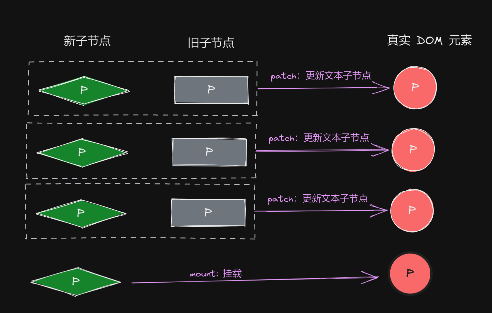

通过上面的分析我们意识到，在进行新旧两组子节点的更新时，不应该总遍历旧的一组子节点或遍历新的一组子节点，而是应该遍历其中长度较短的那一组。这样，我们才能够尽可能多地调用 `patch()` 函数进行更新。接着，再对比新旧两组子节点的长度，如果新的一组子节点更长，则说明有新子节点需要挂载，否则说明有旧子节点需要卸载。代码实现如下：

```js
function patchChildren (n1, n2, container) {
  if (typeof n2.children === 'string') {
    // ...
  } else if (Array.isArray(n2.children)) {
    // 如果新子节点的类型是一组子节点
    // 判断旧子节点是否也是一组子节点
    if (Array.isArray(n1.children)) {
      const oldChildren = n1.children
      const newChildren = n2.children

      // 取得新旧子节点的长度
      const oldLen = oldChildren.length
      const newLen = newChildren.length
      // 取得两组子节点中较短那一组子节点的长度
      const commonLength = Math.min(oldLen, newLen)

      // 遍历旧的 commonLength 次
      for (let i = 0; i < commonLength; i++) {
        // 调用 patch 函数逐个更新子节点
        patch(oldChildren[i], newChildren[i])
      }
      // 如果 newLen > oldLen 则说明有子节点需要挂载
      if (newLen > oldLen) {
        for (let i = commonLength; i < newLen; i++) {
          patch(null, newChildren[i], container)
        }
      } else if (oldLen > newLen) {
        // 如果 oldLen > newLen 说明有旧子节点需要卸载
        for (let i = commonLength; i < oldLen; i++) {
          unmount(oldChildren[i])
        }
      }
    } else {
      // ...
    }
  } else {
    // ...
  }
}
```

这样，无论新旧两组子节点的数量关系如何，渲染器都能够正确地挂载或卸载它们。

## DOM 复用与 key 的作用

我们通过减少 DOM 操作的次数，提升了更新性能。但这种方式仍然存在可优化的空间。假设两组子节点的内容如下：

```js
// oldChildren
[
  { type: 'p' },
  { type: 'div' },
  { type: 'span' }
]

// newChildren
[
  { type: 'span' },
  { type: 'p' },
  { type: 'div' }
]
```

如果使用之前的算法来完成这两组子节点的更新，则需要 6 次的 DOM 操作。

但是，观察新旧两组子节，很容易发现，二者只是顺序不同。所以最优的处理方式是，通过 DOM 的移动来完成子节点的更新，这要比不断地执行子节点的卸载和挂载性能更好。

而想要通过 DOM 的移动来完成更新，必须保证一个前提：新旧两组子节点中的确存在可复用的节点。那么该如何确定新的子节点是否出现在旧的一组子节点呢？拿上面的例子来说，怎么确定新的一个子节点中第 1 个子节点 `{ type: 'span' }` 与旧的子节点中第 3 个子节点相同呢？

一种解决答案是，通过 `vnode.type` 来判断，只要 `vnode.type` 的值相同，我们就认为两者是相同的节点。但这种方式并不可靠，看下面的例子：

```js
// oldChildren
[
  { type: 'p', children: '1' },
  { type: 'p', children: '2' },
  { type: 'p', children: '3' }
]

// newChildren
[
  { type: 'p', children: '3' },
  { type: 'p', children: '1' },
  { type: 'p', children: '2' }
]
```

这两组子节点，我们同样是可以通过移动 DOM 的方式来完成更新。但所有节点的 `vnode.type` 属性值都相同，这导致我们无法确定新旧两组子节点中节点的对应关系，也就无法得知应该进行怎样的 DOM 移动才能完成更新。

这时，我们就需要引入额外的 **key** 来作为 vnode 的标识：

```js
// oldChildren
[
  { type: 'p', children: '1', key: 1 },
  { type: 'p', children: '2', key: 2 },
  { type: 'p', children: '3', key: 3 }
]

// newChildren
[
  { type: 'p', children: '3', key: 3 },
  { type: 'p', children: '1', key: 1 },
  { type: 'p', children: '2', key: 2 }
]
```

key 属性就像虚拟节点的 “身份证” 号，**只要两个虚拟节点的 type 属性值和 key 属性值都相同，那么我们就认为它们是相同的，即可以进行 DOM 的复用。**

下图展示了有 key 和 无 key 时的新旧两组子节点的映射情况：

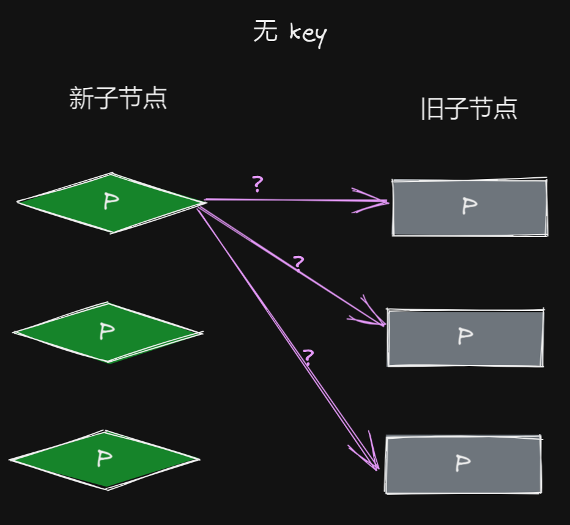

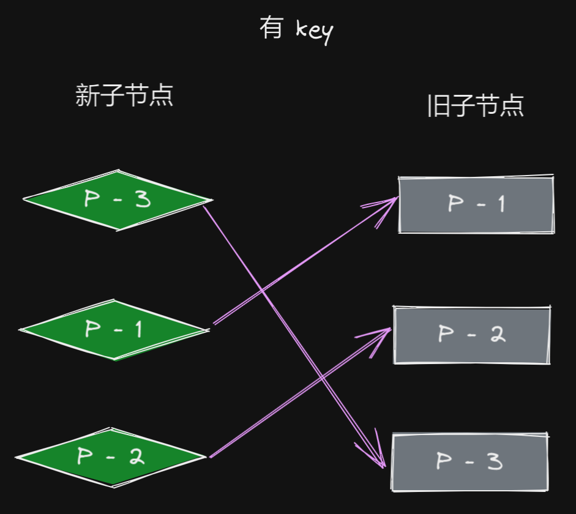

如果没有 key，我们无法知道新子节点与旧子节点间的映射关系，也就无法知道应该如何移动节点。有 key 的话，情况就不同了，我们根据子节点的 key 属性，能够明确知道新子节点在旧子节点中的位置，这样就可以进行相应的 DOM 移动操作了。

但有必要强调一点，DOM 可复用并不代表不需要更新，如下所示：

```js
const oldVnode = { type: 'p', key: 1, children: 'text1' }
const newVnode = { type: 'p', key: 1, children: 'text2' }
```

这两个 vnode 虽然有着相同的 type 和 key，在更新时可以复用 DOM 元素。但仍然需要对这两个虚拟节点进行打补丁操作，因为它们的 children 内容改变了。因此，在讨论如何移动 DOM 之前，我们需要先完成打补丁操作：

```js
function patchChildren (n1, n2, container) {
  if (typeof n2.children === 'string') {
    // ...
  } else if (Array.isArray(n2.children)) {
    // 如果新子节点的类型是一组子节点
    // 判断旧子节点是否也是一组子节点
    if (Array.isArray(n1.children)) {
      const oldChildren = n1.children
      const newChildren = n2.children

      // 遍历新的 children
      for (let i = 0; i < newChildren.length; i++) {
        const newVnode = newChildren[i]

        // 遍历旧的 children
        let j = 0
        for (j; j < oldChildren.length; j++) {
          const oldVnode = oldChildren[j]

          // 如果找到了具有相同 key 值的两个节点，说明可以复用，但仍然需要调用 patch 函数更新
          if (newVnode.key === oldVnode.key) {
            patch(oldVnode, newVnode, container)
            break // 注意，这里需要 break
          }
        }
      }
    } else {
      // ...
    }
  } else {
    // ...
  }
}
```

## 找到需要移动的元素

现在，我们已经能够通过 key 值找到可复用的节点了。接下来需要思考的是，如何判断一个节点是否需要移动，以及如何移动。

对于第一个问题，我们可以采用逆向思维的方式，先想一想在什么情况下节点不需要移动？答案很简单，当新旧两组子节点的节点顺序不变时，就不需要移动操作，如下图所示：

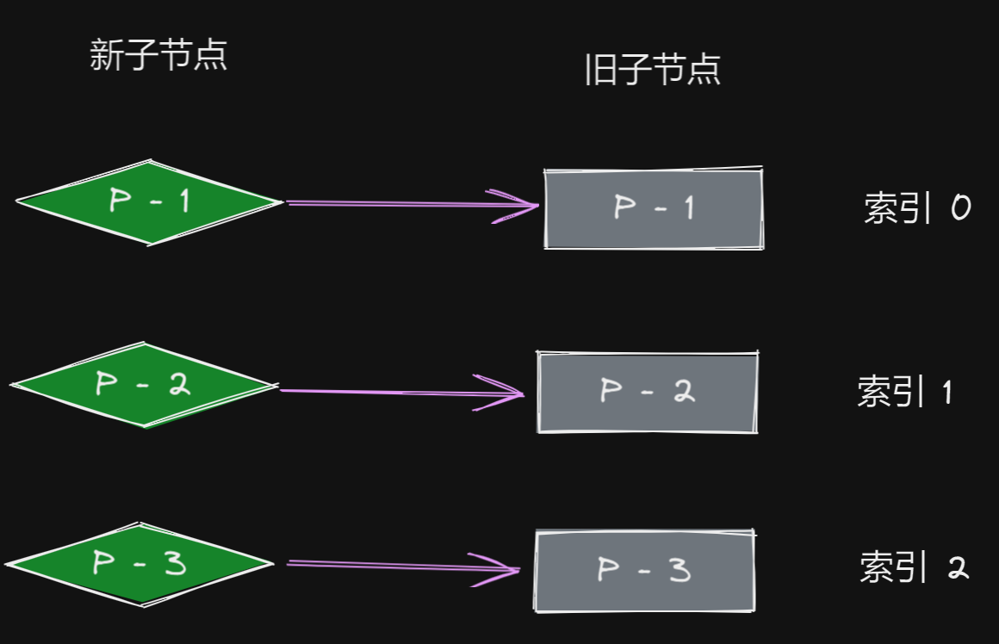

在上图，两组子节点的顺序没有发生变化，图中也给出了旧的一组子节点中各个节点的索引。

接着，我们对新旧两组子节点采用之前介绍的更新算法，看看当新旧两组子节点的顺序没发生变化时，更新算法具有怎样的特点：

1. 取新的一组子节点中的第一个节点 p-1，它的 key 为 1。尝试在旧的一组子节点中找到具有相同 key 值的可复用节点，发现能够找到，并且该节点在旧的一组子节点中的索引为 0；
2. 取新的一组子节点中的第一个节点 p-2，它的 key 为 2。尝试在旧的一组子节点中找到具有相同 key 值的可复用节点，发现能够找到，并且该节点在旧的一组子节点中的索引为 1；
3. 取新的一组子节点中的第一个节点 p-3，它的 key 为 3。尝试在旧的一组子节点中找到具有相同 key 值的可复用节点，发现能够找到，并且该节点在旧的一组子节点中的索引为 2。

在这个过程中，每一次寻找可复用的节点时，都会记录该可复用节点在旧的一组子节点中的位置索引。如果把这些位置索引值按照先后顺序排列，则可以得到一个序列：0、1、2。这是一个递增的序列，在这种情况下不需要移动任何节点。

我们再来看看另外一个例子：


同样，我们再次执行更新算法，看看这一次有什么不同：

1. 取新的一组子节点中的第一个节点 p-3，它的 key 为 3。尝试在旧的一组子节点中找到具有相同 key 值的可复用节点，发现能够找到，并且该节点在旧的一组子节点中的索引为 2；
2. 取新的一组子节点中的第一个节点 p-1，它的 key 为 1。尝试在旧的一组子节点中找到具有相同 key 值的可复用节点，发现能够找到，并且该节点在旧的一组子节点中的索引为 0；
   1. 到了这一步，我们发现，索引值递增的顺序被打破了。节点 p-1 在旧 children 中的索引是 0，它小于节点 p-3 在旧 children 中的索引 2。这说明**节点 p-1 在旧 children 中排在节点 p-3 前面，但在新的 children 中，它排在节点 p-3 后面。**因此，我们能够得出一个结论：**节点 p-1 对应的真实 DOM 需要移动。**
3. 取新的一组子节点中的第一个节点 p-2，它的 key 为 2。尝试在旧的一组子节点中找到具有相同 key 值的可复用节点，发现能够找到，并且该节点在旧的一组子节点中的索引为 1；
   1. 到了这一步，我们发现，节点 p-2 在旧 children 中的索引是 1，它小于节点 p-3 在旧 children 中的索引 2。这说明**节点 p-2 在旧 children 中排在节点 p-3 前面，但在新的 children 中，它排在节点 p-3 后面。**因此，我们能够得出一个结论：**节点 p-2 对应的真实 DOM 需要移动。**

以上，就是 Diff 算法在执行更新过程中，判断节点是否需要移动的方式。在上面的例子中，我们得出了节点 p-1 和节点 p-2 需要移动的结论。这是因为它们在旧 children 中的索引要小于节点 p-3 在旧 children 中的索引。如果我们按照先后顺序记录在寻找节点过程中所遇到的位置索引，将会得到序列：2、0、1。可以发现，这个序列不具有递增的趋势。

其实我们可以将节点 p-3 在旧 children 中的索引定义为：**在旧 children 中寻找具有相同 key 值节点的过程中，遇到的最大索引值。**如果在后续寻找的过程中，存在索引值比当前遇到的最大索引值还要小的节点，则意味着该节点需要移动。

我们可以用 lastIndex 变量存储整个寻找过程中遇到的最大索引值，如下代码所示：

```js
function patchChildren (n1, n2, container) {
  if (typeof n2.children === 'string') {
    // ...
  } else if (Array.isArray(n2.children)) {
    // 如果新子节点的类型是一组子节点
    // 判断旧子节点是否也是一组子节点
    if (Array.isArray(n1.children)) {
      const oldChildren = n1.children
      const newChildren = n2.children

      // 用来记录寻找过程中遇到的最大索引值
      let lastIndex = 0

      // 遍历新的 children
      for (let i = 0; i < newChildren.length; i++) {
        const newVnode = newChildren[i]

        // 遍历旧的 children
        let j = 0
        for (j; j < oldChildren.length; j++) {
          const oldVnode = oldChildren[j]

          // 如果找到了具有相同 key 值的两个节点，说明可以复用，但仍然需要调用 patch 函数更新
          if (newVnode.key === oldVnode.key) {
            patch(oldVnode, newVnode, container)

            if (j < lastIndex) {
              // 如果当前找到的节点在旧 children 中的索引小于最大索引值 lastIndex
              // 说明该节点对应的真实 DOM 需要移动
            } else {
              // 如果当前找到的节点在旧 children 中的索引不小于最大索引值
              // 则更新 lastIndex 的值
              lastIndex = j
            }

            break // 注意，这里需要 break
          }
        }
      }
    } else {
      // ...
    }
  } else {
    // ...
  }
}
```

## 如何移动元素

我们已经做到了怎么判断节点是否需要移动。接下来我们将讨论如何移动节点，移动节点指的是，移动一个虚拟节点所对应的真实 DOM 节点，并不是移动虚拟节点本身。既然移动的是真实 DOM 节点，那么就需要取得它的引用教徒。我们知道，当一个虚拟节点被挂载后，其对应的真实 DOM 节点会存储在它的 `vnode.el` 属性中，如下图：


因此，在代码中，我们可以通过旧子节点的 `vnode.el` 属性取得它对应的真实 DOM 节点。

当更新操作发生时，渲染器会调用 `patchElement()` 函数在新旧虚拟节点之间进行打补丁。我们回顾一下 `patchElement()` 函数的代码：

```js
function patchElement (n1, n2) {
  // 新的 vnode 也引用了真实 DOM 元素
  const el = n2.el = n1.el
  // ...
}
```

可以看到，`patchElement()` 函数首先将旧节点的 `n1.el` 属性赋值给新节点 `n2.el` 属性。这个赋值语句的**真正含义其实就是 DOM 元素的复用。**在复用了 DOM 元素之后，新节点也将持有对真实 DOM 的引用，如下图：


在此基础上，我们就可以进行 DOM 移动操作了。为了阐述具体应该怎样移动 DOM 节点，我们仍然使用上一节的更新案例：


它的更新步骤如下：

1. 取新的一组子节点中的第一个节点 p-3，它的 key 为 3，尝试在旧的一组子节点中找到具有相同 key 值的可复用节点，发现能够找到，并且该节点在旧的一组子节点中的索引为 2。此时变量 lastIndex 的值为 0，索引 2 不小于 0，所以节点 p-3 对应的真实 DOM 不需要移动，但需要更新变量 lastIndex 的值为 2；

2. 取新的一组子节点中的第一个节点 p-1，它的 key 为 1，尝试在旧的一组子节点中找到具有相同 key 值的可复用节点，发现能够找到，并且该节点在旧的一组子节点中的索引为 0。此时变量 lastIndex 的值为 2，索引 0 小于 2，所以节点 p-1 对应的真实 DOM 需要移动；

   1. 到了这一步，我们发现，节点 p-1 对应的真实 DOM 需要移动，但应该移动到哪里呢？我们知道，**新 children 的顺序其实就是更新后真实 DOM 节点应有的顺序。**所以节点 p-1 在新 children 中的位置就代表了真实 DOM 更新后的位置。由于节点 p-1 在新 children 中排在节点 p-3 后面，所以我们应该**把节点 p-1 所对应的真实 DOM 移动到节点 p-3 所对应的真实 DOM 后面。**移动后的结果如下图所示：

      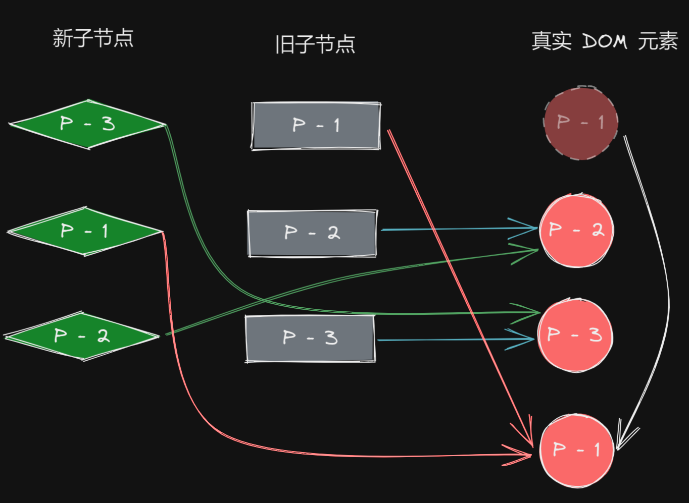

      可以看到，这样操作之后，此时真实 DOM 的顺序为 p-2、p-3、p-1。

3. 取新的一组子节点中的第一个节点 p-2，它的 key 为 2，尝试在旧的一组子节点中找到具有相同 key 值的可复用节点，发现能够找到，并且该节点在旧的一组子节点中的索引为 1。此时变量 lastIndex 的值为 2，索引 1 小于 2，所以节点 p-2 对应的真实 DOM 需要移动；

   1. 与第二步类似，节点 p-2 对应的真实 DOM 也需要移动。同样，由于节点 p-2 在新 children 中排在节点 p-1 后面，所以我们应该把节点 p-2 对应的真实 DOM 移动到节点 p-1 对应的真实 DOM 后面。移动的结果如下图：

      

      经过这一步移动操作之后，我们发现真实 DOM 的顺序与新的一组子节点的顺序相同了：p-3、p-1、p-2。至此，更新操作完成。

接下来，我们着手实现代码。其实并不复杂，如下面代码所示 ：

```js
function patchChildren (n1, n2, container) {
  if (typeof n2.children === 'string') {
    // ...
  } else if (Array.isArray(n2.children)) {
    // 如果新子节点的类型是一组子节点
    // 判断旧子节点是否也是一组子节点
    if (Array.isArray(n1.children)) {
      const oldChildren = n1.children
      const newChildren = n2.children

      // 用来记录寻找过程中遇到的最大索引值
      let lastIndex = 0

      // 遍历新的 children
      for (let i = 0; i < newChildren.length; i++) {
        const newVnode = newChildren[i]

        // 遍历旧的 children
        let j = 0
        for (j; j < oldChildren.length; j++) {
          const oldVnode = oldChildren[j]

          // 如果找到了具有相同 key 值的两个节点，说明可以复用，但仍然需要调用 patch 函数更新
          if (newVnode.key === oldVnode.key) {
            patch(oldVnode, newVnode, container)

            if (j < lastIndex) {
              // 如果当前找到的节点在旧 children 中的索引小于最大索引值 lastIndex
              // 说明该节点对应的真实 DOM 需要移动
              // 先获取 newVnode 的前一个 vnode，即 prevVnode
              const prevVNode = newChildren[i - 1]

              // 如果 prevVNode 不存在，则说明当前 newVNode 是第一个节点，它不需要移动
              if (prevVNode) {
                // 由于我们要将 newVNode 对应的真实 DOM 移动到 prevVNode 所对应真实 DOM 后面，
                // 所以我们需要获取 prevVNode 所对应真实 DOM 的下一个兄弟节点，并将其作为锚点
                const anchor = prevVNode.el.nextSibling
                // 调用 insert 方法将 newVNode 对应的真实 DOM 插入到锚点元素前面，
                // 也就是 prevVNode 对应真实 DOM 的后面
                insert(newVnode.el, container, anchor)
              }
            } else {
              // 如果当前找到的节点在旧 children 中的索引不小于最大索引值
              // 则更新 lastIndex 的值
              lastIndex = j
            }

            break // 注意，这里需要 break
          }
        }
      }
    } else {
      // ...
    }
  } else {
    // ...
	}
}
```

而 `insert()` 方法，我们提取到配置里面：

```js
const renderer = createRenderer({
  // ...
  insert (el, parent, anchor = null) {
    // insertBefore 需要锚点元素 anchor
    parent.insertBefore(el, anchor)
  }
})
```

## 添加新元素

接下来我们讨论添加新节点的情况，如下图所示：

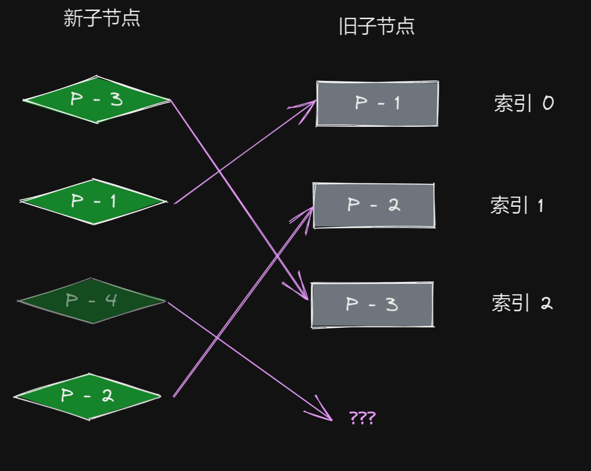

从上图可知，在新的一组子节点中，多了一个节点 p-4，它的 key 值为 4，该节点在旧的一组子节点不存在，因此应该将其视为新增节点。对于新增节点，在更新时，我们应该正确地将它挂载，主要分为以下两步：

1. 找到新增节点；
2. 将新增节点挂载到正确的位置。

首先，我们来看一下如何找到新增节点。为了搞清楚这个问题，我们需要根据上图例子模拟执行简单 Diff 算法的逻辑。在此之前，我们需要弄清楚新旧两组子节点与真实 DOM 元素的当前状态，如下图：

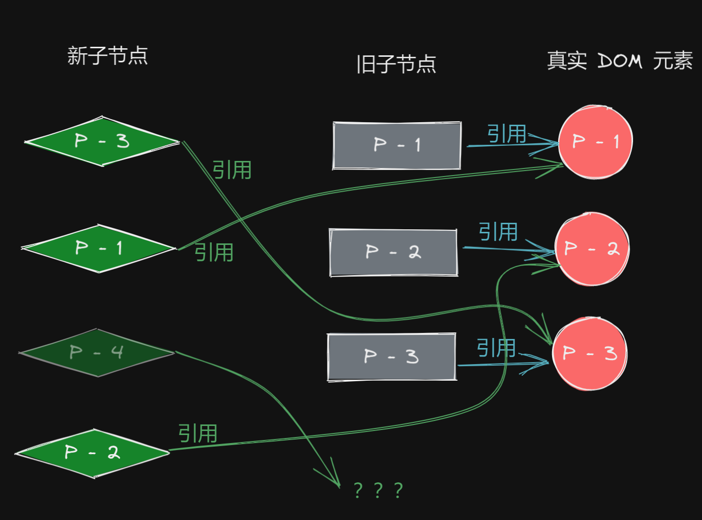

接下来，我们开始模拟执行简单 Diff 算法的更新逻辑：

1. 取新的一组子节点中的第一个节点 p-3，它的值 key 为3，尝试在旧的一组子节点中寻找可复用的节点。发现能够找到，并且该节点在旧的一组子节点中的索引值为 2。此时，变量 lastIndex 的值为 0，索引值 2 不小于 lastIndex 的值 0，所以节点 p-3 对应的真实 DOM 不需要移动，但是需要将变量 lastIndex 的值更新为 2；

2. 取新的一组子节点中的第一个节点 p-1，它的值 key 为1，尝试在旧的一组子节点中寻找可复用的节点。发现能够找到，并且该节点在旧的一组子节点中的索引值为 0。此时，变量 lastIndex 的值为 2，索引值 0 小于 lastIndex 的值 2，所以节点 p-1 对应的真实 DOM 需要移动，并且应该移动到节点 p-3 对应的真实 DOM 后面。经过这一步的移动操作后，真实 DOM 的状态如下图所示：

   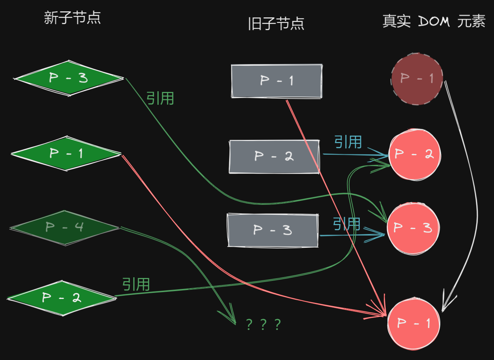

   此时真实 DOM 的顺序为 p-2、p-3、p-1。

3. 取新的一组子节点中的第一个节点 p-4，它的值 key 为4，尝试在旧的一组子节点中寻找可复用的节点。由于在旧的一组子节点中，没有 key 值为 4 的节点，因此渲染器会把节点 p-4 看作新增节点挂载它。那么应该将他挂载到哪里呢？为了搞清楚这个问题，我们需要观察节点 p-4 在新的一组子节点中的位置。由于节点 p-4 出现在节点 p-1 后面，所以我们应该把节点 p-4 挂载到节点 p-1 所对应的真实 DOM 后面。在经过挂载操作之后，真实 DOM 的状态如下图所示：

   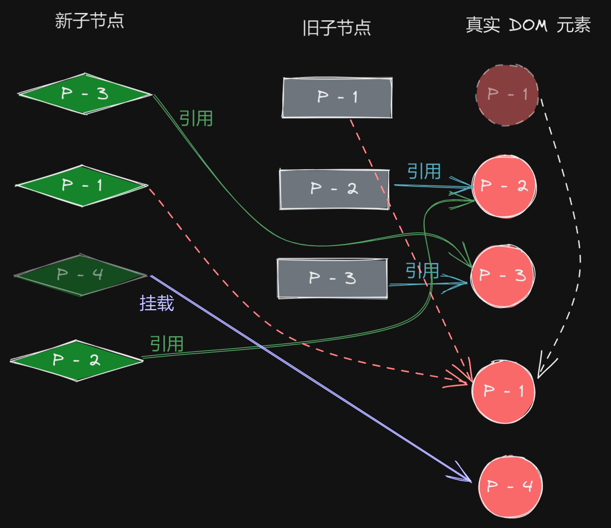

   此时真实 DOM 的顺序为 p-2、p-3、p-1、p-4，其中 p-4 是刚刚挂载的。

4. 取新的一组子节点中第四个节点 p-2，它的 key 值为 2，尝试在旧的一组子节点中寻找可复用的节点。发现能够找到，并且该节点在旧的一组子节点中的索引值为 1。此时变量 lastIndex 的值为 2，索引值 1 小于 lastIndex 的值 2，所以节点 p-2 对应的真实 DOM 需要移动，并且应该移动到节点 p-4 对应的真实 DOM 后面。经过这一步操作后，真实 DOM 的状态如下图：

   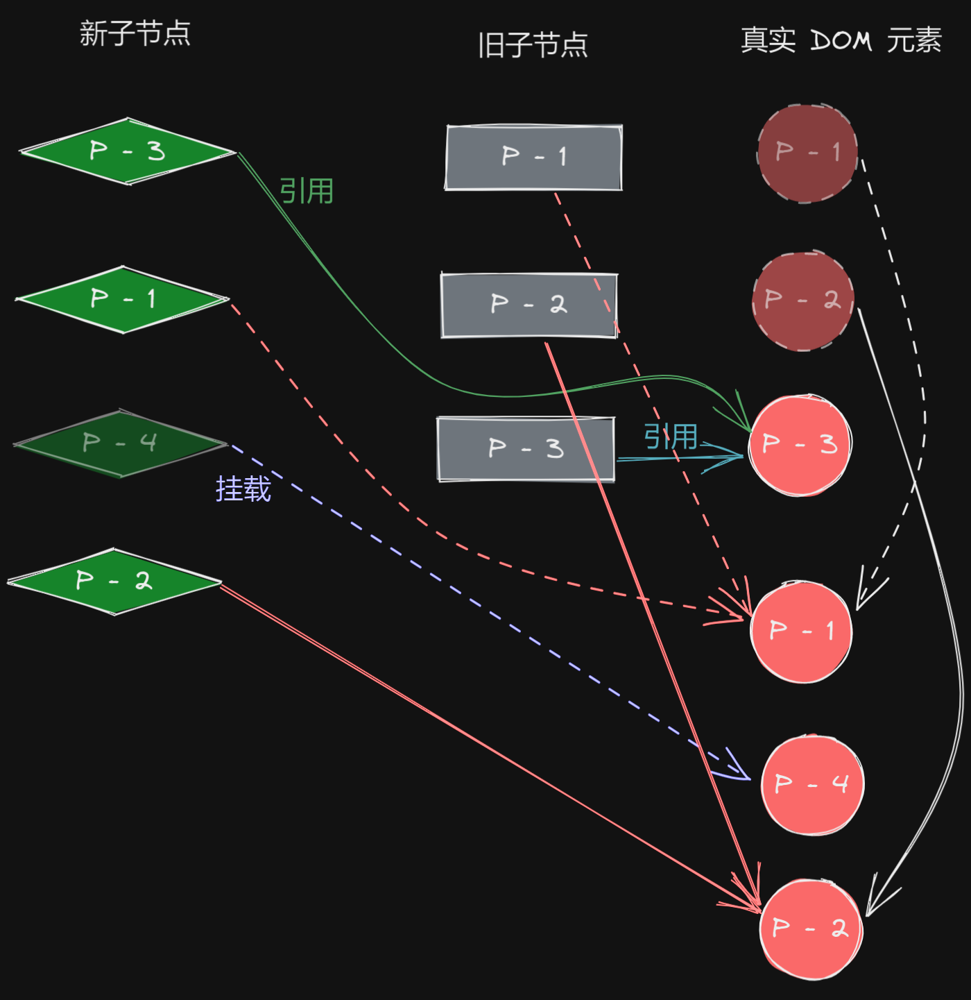

   此时真实 DOM 的顺序是：p-3、p-1、p-4、p-2。至此，真实 DOM 的顺序已经与新的一组子节点的顺序相同，更新完成。

接下来，我们着手实现代码，如下面 `patchChildren()` 函数的代码所示：

```js
function patchChildren (n1, n2, container) {
  if (typeof n2.children === 'string') {
    // ...
  } else if (Array.isArray(n2.children)) {
    if (Array.isArray(n1.children)) {
      const oldChildren = n1.children
      const newChildren = n2.children

      let lastIndex = 0

      for (let i = 0; i < newChildren.length; i++) {
        const newVnode = newChildren[i]

        // 在第一层循环中定义变量 find，代表是否在旧的一组子节点中找到可复用的节点，
        // 初始值为 false，代表没找到
        let find = false

        let j = 0
        for (j; j < oldChildren.length; j++) {
          const oldVnode = oldChildren[j]

          if (newVnode.key === oldVnode.key) {
            // 一旦找到可复用的节点，则将变量 find 的值设为 true
            find = true
            patch(oldVnode, newVnode, container)

            if (j < lastIndex) {
              const prevVNode = newChildren[i - 1]

              if (prevVNode) {
                const anchor = prevVNode.el.nextSibling
                insert(newVnode.el, container, anchor)
              }
            } else {
              lastIndex = j
            }

            break // 注意，这里需要 break
          }
        }

        // 如果代码运行到了这里，find 仍然为 false，
        // 说明当前 newVNode 没有在旧的一组子节点中找到可复用的节点
        // 也就是说，当前 newVNode 是新增节点，需要挂载
        if (!find) {
          // 为了将节点挂载到正确位置，我们需要先获取锚点元素
          // 首先获取当前 newVNode 的前一个 vnode 节点
          const prevVNode = newChildren[i - 1]
          let anchor = null
          if (prevVNode) {
            // 如果有前一个 vnode 节点，则使用它的下一个兄弟节点作为锚点元素
            anchor = prevVNode.el.nextSibling
          } else {
            // 如果没有前一个 vnode 节点，说明即将挂载的新节点是第一个子节点
            // 这时我们使用容器元素的 firstChild 作为锚点
            anchor = container.firstChild
          }

          // 挂载 newVNode
          patch(null, newVnode, container, anchor)
        }
      }
    } else {
      // ...
    }
  } else {
    // ...
  }
}
```

由于目前实现的 `patch()` 函数还不支持传递第四个参数，所以我们需要调整 `patch()` 函数的代码：

```js
function patch (n1, n2, container, anchor) {
  // ...
  if (typeof type === 'string') {
    if (!n1) {
      // 挂载时将锚点元素作为第三个参数传递给 mountElement 函数
      mountElement(n2, container, anchor)
    } else {
      patchElement(n1, n2)
    }
  } else if (typeof type === 'object') {
    // ...
  } else if (type === VNODE_TYPES.Text) {
    // ...
  } else if (type === VNODE_TYPES.Comment) {
    // ...
  } else if (type === VNODE_TYPES.Fragment) {
    // ...
  }
}
```

## 移除不存在的元素

在更新子节点时，不仅会遇到新增元素，还会出现元素被删除的情况，如下图：

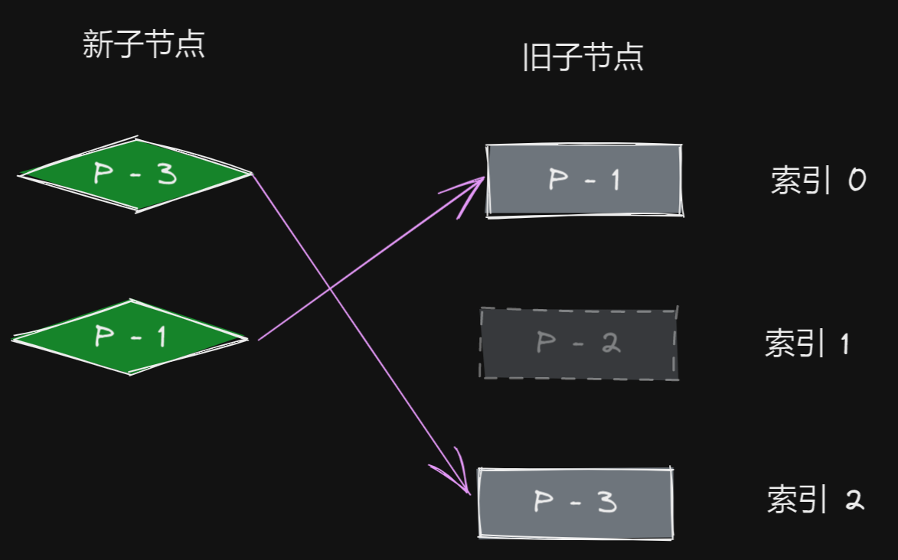

在新的一组子节点中，节点 p-2 已经不存在了，这说明该节点被删除了。渲染器应该能找到那些需要删除的节点并正确地将其删除。

具体要如何做呢？首先，我们来讨论如何找到需要删除的节点。以上图为例，我们分析它的更新步骤。在模拟执行更新逻辑之前，我们需要清楚新旧两组子节点以及真实 DOM 节点的当前状态，如下图所示：

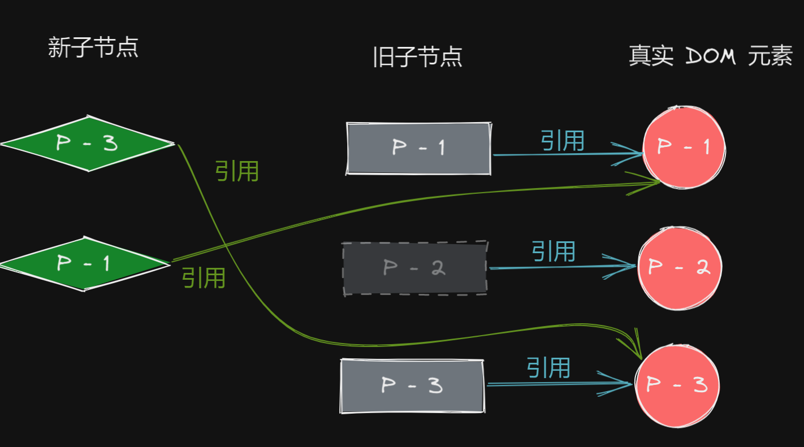

接下来，我们开始模拟执行更新的过程：

1. 取新的一组子节点中的第一个节点 p-3，它的 key 值为 3。尝试在旧的一组子节点中寻找可复用的节点。发现能够找到，并且该节点在旧的一组子节点中的索引值为 2。此时变量 lastIndex 的值为 0，索引 2 不小于 lastIndex 的值 0，所以节点 p-3 对应的真实 DOM 不需要移动，但需要更新 lastIndex 的值为 2；
2. 取新的一组子节点中的第一个节点 p-1，它的 key 值为 1。尝试在旧的一组子节点中寻找可复用的节点。发现能够找到，并且该节点在旧的一组子节点中的索引值为 0。此时变量 lastIndex 的值为 2，索引 0 小于 lastIndex 的值 2，所以节点 p-1 对应的真实 DOM 需要移动，并且应该移动到节点 p-3 对应的真实 DOM 后面。经过这一步操作后，真实 DOM 的状态如下图所示：


至此，更新结束。我们发现，节点 p-2 对应的真实 DOM 仍然存在，所以需要增加额外的逻辑来删除遗留节点。思路很简单，当基本的更新结束时，我们需要遍历旧的一组子节点，然后去新的一组子节点中寻找具有相同 key 值的节点。如果找不到，则说明应该删除节点，如下代码所示：

```js
function patchChildren (n1, n2, container) {
  if (typeof n2.children === 'string') {
    // ...
  } else if (Array.isArray(n2.children)) {
    if (Array.isArray(n1.children)) {
      const oldChildren = n1.children
      const newChildren = n2.children

      // 用来记录寻找过程中遇到的最大索引值
      let lastIndex = 0

      // ... 省略

      // 上一步的更新操作完成后
      // 遍历旧的一组子节点
      for (let i = 0; i < oldChildren.length; i++) {
        const oldVnode = oldChildren[i]
        // 拿旧子节点去新的一组子节点中寻找具有相同 key 值的节点
        const has = newChildren.find(vnode => vnode.key === oldVnode.key)

        if (!has) {
          // 如果没有找到具有相同 key 值的节点，则说明需要删除该节点
          // 调用 unmount 函数将其卸载
          unmount(oldVnode)
        }
      }
    } else {
      // ...
    }
  } else {
    // ...
  }
}
```

如以上代码及注释所示，在上一步的更新操作完成之后，我们还需要遍历旧的一组子节点，目的是检查旧子节点在新的一组子节点中是否仍然存在，如果已经不存在了，则调用 `unmount()` 函数将其卸载。

