# 双端 Diff 算法

之前，我们介绍了简单的 Diff 算法，利用虚拟节点的 key 属性，尽可能地复用 DOM 元素，并通过移动 DOM 的方式来完成更新，从而减少不断地创建和销毁 DOM 元素带来的性能开销。但是，简单的 Diff 算法仍然存在很多缺陷，这些缺陷可以通过接下来要介绍的双端 Diff 算法解决。

## 双端比较的原理

简单 Diff 算法的问题在于，它对 DOM 的移动操作并不是最优的。我们拿之前的例子来看，如下图所示：


在这个例子中，如果使用简单 Diff 算法来更新它，会发生两次 DOM 移动操作，如下图所示：


然而，上述更新过程并非最优化解。在这个例子中，理想状态应该只需要通过一步 DOM 节点的移动操作即可完成更新，即只需要把真实 DOM 节点 p-3 移动到真实 DOM 节点 p-1 前面，如下图所示：


可以看到，理论上只需要一次 DOM 移动操作即可完成更新。但简单 Diff 算法做不到这一点，再接下来我们讨论的双端 Diff 算法可以做到。

**双端 Diff 算法，顾名思义，是一种同时对新旧两组子节点的两个端点进行比较的算法**。因此，我们需要四个索引值，分别指向新旧两组子节点的端点，如下图所示：

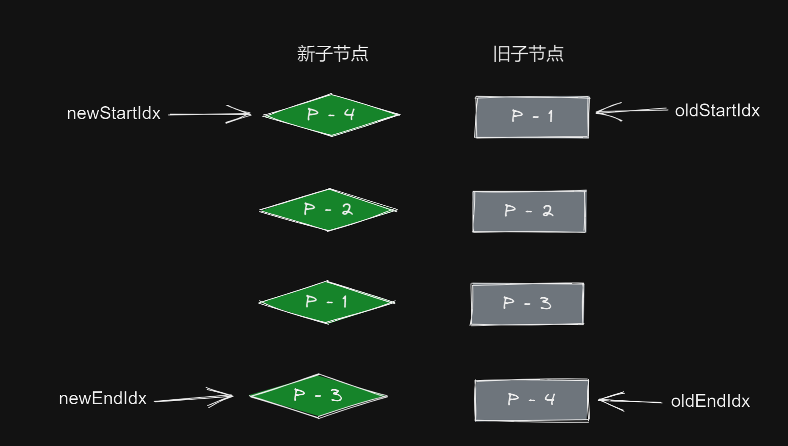

用代码来表达四个端点，如下面 `patchChildren()` 和 `patchKeyedChildren()` 函数的代码所示：

```js
function patchChildren (n1, n2, container) {
  if (typeof n2.children === 'string') {
    // ...
  } else if (Array.isArray(n2.children)) {
    if (Array.isArray(n1.children)) {
      // 封装 patchKeyedChildren 函数处理两组子节点
      patchKeyedChildren(n1, n2, container)
    } else {
      // ...
    }
  } else {
    //...
  }
}

function patchKeyedChildren (n1, n2, container) {
  const oldChildren = n1.children
  const newChildren = n2.children
  // 四个索引值
  let oldStartIdx = 0
  let oldEndIdx = oldChildren.length - 1
  let newStartIdx = 0
  let newEndIdx = newChildren.length - 1
  }
```

这样，我们就可以通过这些索引值来找到它指向的虚拟节点了：

```js
function patchKeyedChildren (n1, n2, container) {
  const oldChildren = n1.children
  const newChildren = n2.children
  // 四个索引值
  let oldStartIdx = 0
  let oldEndIdx = oldChildren.length - 1
  let newStartIdx = 0
  let newEndIdx = newChildren.length - 1
  // 四个索引值指向 vnode 节点
  let oldStartVNode = oldChildren[oldStartIdx]
  let oldEndVNode = oldChildren[oldEndIdx]
  let newStartVNode = newChildren[newStartIdx]
  let newEndVNode = newChildren[newEndIdx]
  }
```

其中，`oldStartVNode` 和 `oldEndVNode` 是旧的一组子节点中的第一个节点和最后一个节点，而 `newStartVNode` 和 `newEndVNode` 是新的一组子节点中的第一个节点和最后一个节点，有了这些信息之后，我们就可以开始进行双端比较了。如下图所示：

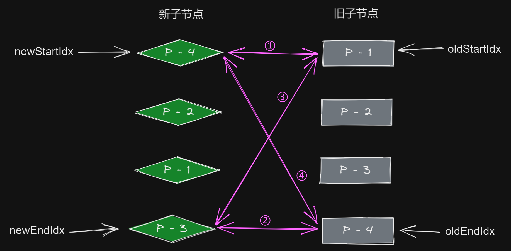

在双端比较中，每一轮比较都分为四个步骤，如上图的连接所示：

1. 比较旧的一组子节点中的第一个子节点 p-1 与新的一组子节点中的第一个子节点 p-4，看看它们是否相同。由于两者的 key 值不同，因此不相同，不可复用，于是什么都不做；
2. 比较旧的一组子节点中的最后一个子节点 p-4 与新的一组子节点中的最后一个子节点 p-3，看看它们是否相同。由于两者的 key 值不同，因此不相同，不可复用，于是什么都不做；
3. 比较旧的一组子节点中的第一个子节点 p-1 与新的一组子节点中的最后一个子节点 p-3，看看它们是否相同。由于两者的 key 值不同，因此不相同，不可复用，于是什么都不做；
4. 比较旧的一组子节点中的最后一个子节点 p-4 与新的一组子节点中的第一个子节点 p-4，看看它们是否相同。由于它们的 key 值相同，因此可以进行 DOM 复用。

可以看到，我们在第四步时，找到了相同的节点，这说明它们对应的真实 DOM 节点可以复用。对于可复用的节点，我们只需要通过 DOM 移动操作完成更新即可。那么应该如何移动 DOM 元素呢？

为了搞清这个问题，我们需要分析第四步比较过程中的细节。我们注意到，第④步是比较旧的一组子节点的最后一个子节点与新的一组子节点的第一个子节点，发现两者相同。这说明：**节点 p-4 原本是最后一个子节点，但在新的顺序中，它变成了第一个子节点。**换句话说，节点 p-4 在更新之后应该是第一个子节点。对应到程序的逻辑，可以将其翻译为：**将索引 oldEndIdx 指向的虚拟节点所对应的真实 DOM 移动到索引 oldStartIdx 指向的虚拟节点所对应的真实 DOM 前端。**如下面的代码所示：

```js
function patchKeyedChildren (n1, n2, container) {
  const oldChildren = n1.children
  const newChildren = n2.children
  // 四个索引值
  let oldStartIdx = 0
  let oldEndIdx = oldChildren.length - 1
  let newStartIdx = 0
  let newEndIdx = newChildren.length - 1
  // 四个索引值指向 vnode 节点
  let oldStartVNode = oldChildren[oldStartIdx]
  let oldEndVNode = oldChildren[oldEndIdx]
  let newStartVNode = newChildren[newStartIdx]
  let newEndVNode = newChildren[newEndIdx]

  if (oldStartVNode.key === newStartVNode.key) {
    // 第 ① 步: oldStartVNode 与 newStartVNode 比较
  } else if (oldEndVNode.key === newEndVNode.key) {
    // 第 ② 步: oldEndVNode 与 newEndVNode 比较
  } else if (oldStartVNode.key === newEndVNode.key) {
    // 第 ③ 步: oldStartVNode 与 newEndVNode 比较
  } else if (oldEndVNode.key === newStartVNode.key) {
    // 第 ④ 步: oldEndVNode 与 newStartVNode 比较

    // 仍然需要调用 patch 函数进行打补丁
    patch(oldEndVNode, newStartVNode, container)
    // 移动 DOM 移动
    // oldEndVNode.el 移动到 oldStartVNode.el 前面
    insert(oldEndVNode.el, container, oldStartVNode.el)

    // 移动 DOM 完成后，更新索引值，并指向下一个位置
    oldEndVNode = oldChildren[--oldEndIdx]
    newStartVNode = newChildren[++newStartIdx]
  }
}
```

上面的代码我们实现了四个索引指向的虚拟节点之间的比较。拿上例来说，在第 ④ 步中，我们找到了具有相同 key 值的节点。这说明，原来 处于尾部的节点在新的顺序中应该处于头部。于是，我们只需要以头部元素 `oldStartVNode.el` 作为锚点，将尾部元素 `oldEndVNode.el` 移动到锚点前面即可。但需要注意的是，在进行 DOM 移动操作之前，仍然需要调用 `patch()` 函数在新旧虚拟节点之间打补丁。

在这一步 DOM 的移动操作完成后，接下来是比较关键的步骤，即更新索引值。由于第 ④ 步中涉及的两个索引分别是 oldEndIdx 和 newStartIdx，所以我们需要更新两者的值，让它们各自朝正确的方向前进一步，并指向下一个节点。下图给出了更新前新旧两组子节点以及真实 DOM 节点的状态： 

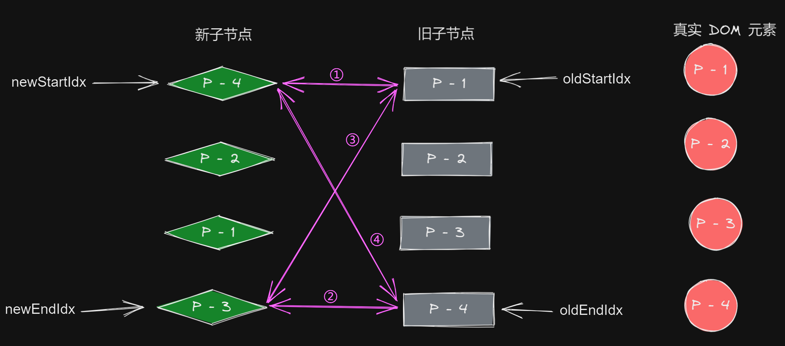

下图给出在第 ④ 步比较中，DOM 移动操作完成后，新旧两组子节点以及真实 DOM 节点的状态：


此时，真实 DOM 节点的顺序为 p-4、p-1、p-2、p-3，这与新的一组子节点顺序不一致。这是因为 Diff 算法还没有结束，还需要进行下一轮更新。因为，我们需要将更新逻辑封装一个 while 循环中，如下面代码所示：

```js
while (oldStartIdx <= oldEndIdx && newStartIdx <= newEndIdx) {
  if (oldStartVNode.key === newStartVNode.key) {
    // 第 ① 步: oldStartVNode 与 newStartVNode 比较
  } else if (oldEndVNode.key === newEndVNode.key) {
    // 第 ② 步: oldEndVNode 与 newEndVNode 比较
  } else if (oldStartVNode.key === newEndVNode.key) {
    // 第 ③ 步: oldStartVNode 与 newEndVNode 比较
  } else if (oldEndVNode.key === newStartVNode.key) {
    // 第 ④ 步: oldEndVNode 与 newStartVNode 比较

    // 仍然需要调用 patch 函数进行打补丁
    patch(oldEndVNode, newStartVNode, container)
    // 移动 DOM 移动
    // oldEndVNode.el 移动到 oldStartVNode.el 前面
    insert(oldEndVNode.el, container, oldStartVNode.el)

    // 移动 DOM 完成后，更新索引值，并指向下一个位置
    oldEndVNode = oldChildren[--oldEndIdx]
    newStartVNode = newChildren[++newStartIdx]
  }
}
```

由于在每一轮更新完成之后，紧接着都会更新四个索引中与当前更新轮次相关联的索引，所以整个 while 循环执行的条件是：头部索引值要小于等于尾部索引值。

在第一轮更新结束后循环条件仍然成立，因此需要进行下一轮的比较，如上面的图所示：

1. 比较旧的一组子节点中的头部节点 p-1 与新的一组子节点中的头部节点 p-2，看看它们是否相同。由于两者的 key 值不同，不可复用，所以什么都不做；

   这里，我们使用了新的名词：**头部节点。**它指的是头部索引 oldStartIdx 和 newStartIdx 所指向的节点。

2. 比较旧的一组子节点中的尾部节点 p-3 与新的一组子节点中的尾部节点 p-3，两者的 key 值相同，可以复用。另外，由于两者都处于尾部，因此不需要对真实 DOM 进行移动操作，只需要打补丁即可。

```js
while (oldStartIdx <= oldEndIdx && newStartIdx <= newEndIdx) {
  if (oldStartVNode.key === newStartVNode.key) {
    // 第 ① 步: 旧头部节点 oldStartVNode 与新头部节点 newStartVNode 比较
  } else if (oldEndVNode.key === newEndVNode.key) {
    // 第 ② 步: 旧尾部节点 oldEndVNode 与新尾部节点 newEndVNode 比较

    // 节点在新的顺序中仍然处于尾部，不需要移动，但仍需打补丁
    patch(oldEndVNode, newEndVNode, container)

    // 更新索引和头尾部节点变量
    oldEndVNode = oldChildren[--oldEndIdx]
    newEndVNode = newChildren[--newEndIdx]
  } else if (oldStartVNode.key === newEndVNode.key) {
    // 第 ③ 步: 旧头部节点 oldStartVNode 与新尾部节点 newEndVNode 比较
  } else if (oldEndVNode.key === newStartVNode.key) {
    // 第 ④ 步: 旧尾部节点 oldEndVNode 与新头部节点 newStartVNode 比较

    // 仍然需要调用 patch 函数进行打补丁
    patch(oldEndVNode, newStartVNode, container)
    // 移动 DOM 移动
    // oldEndVNode.el 移动到 oldStartVNode.el 前面
    insert(oldEndVNode.el, container, oldStartVNode.el)

    // 移动 DOM 完成后，更新索引值，并指向下一个位置
    oldEndVNode = oldChildren[--oldEndIdx]
    newStartVNode = newChildren[++newStartIdx]
  }
}
```

在这一轮更新完成之后，新旧两组子节点与真实 DOM 节点的状态如下图所示：


真实 DOM 的顺序相比上一轮没有变化，因为这一轮的比较中没有对 DOM 节点进行移动，只是对 p-3 节点打补丁。接下来，我们再根据上图所示状态执行下一轮的比较：

1. 比较旧的一组子节点的头部节点 p-1 与新的一组子节点中的头部节点 p-2，看看它们是否相同。由于两者 key 值不同，不可复用，因此什么都不做；
2. 比较旧的一组子节点的头部节点 p-2 与新的一组子节点中的头部节点 p-1，看看它们是否相同。由于两者 key 值不同，不可复用，因此什么都不做；
3. 比较旧的一组子节点的头部节点 p-1 与新的一组子节点中的头部节点 p-1，看看它们是否相同。两者 key 值相同，可复用。

在第 ③ 步比较中，我们找到了相同的节点，这说明：**节点 p-1 原本是头部节点，但在新的顺序中，它变成了尾部节点。**因此，我们需要将节点 p-1 对应的真实 DOM 移动到旧的一组子节点尾部节点 p-2 所对应的真实 DOM 后面，同时还需要更新相应的索引到下一个位置，如下图所示：

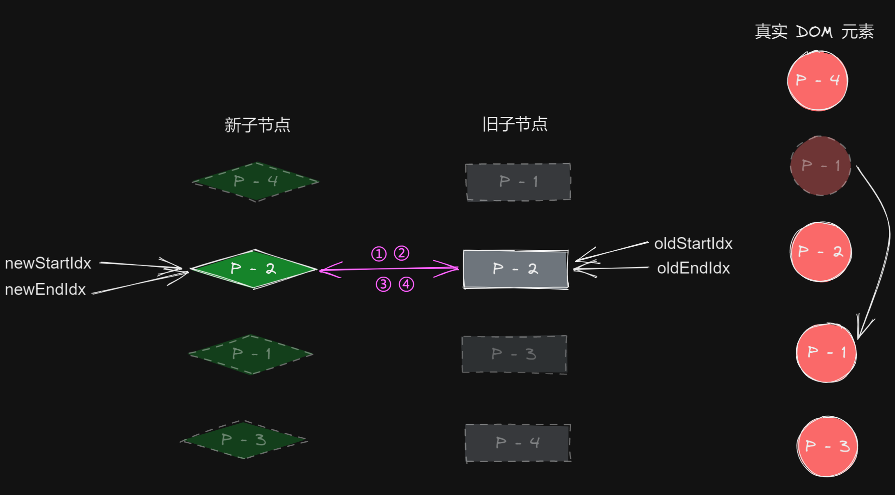

这一步的代码实现如下：

```js
while (oldStartIdx <= oldEndIdx && newStartIdx <= newEndIdx) {
  if (oldStartVNode.key === newStartVNode.key) {
    // 第 ① 步: 旧头部节点 oldStartVNode 与新头部节点 newStartVNode 比较
  } else if (oldEndVNode.key === newEndVNode.key) {
    // 第 ② 步: 旧尾部节点 oldEndVNode 与新尾部节点 newEndVNode 比较

    // 节点在新的顺序中仍然处于尾部，不需要移动，但仍需打补丁
    patch(oldEndVNode, newEndVNode, container)

    // 更新索引和头尾部节点变量
    oldEndVNode = oldChildren[--oldEndIdx]
    newEndVNode = newChildren[--newEndIdx]
  } else if (oldStartVNode.key === newEndVNode.key) {
    // 第 ③ 步: 旧头部节点 oldStartVNode 与新尾部节点 newEndVNode 比较

    // 调用 patch 函数在 oldStartVNode 和 newEndVNode 之间打补丁
    patch(oldStartVNode, newEndVNode, container)

    // 将旧的一组子节点的头部节点对应的真实 DOM 节点 oldStartVNode.el 移动到
    // 旧的一组子节点的尾部节点对应的真实 DOM 节点后面
    insert(oldStartVNode.el, container, oldEndVNode.el.nextSibling)

    // 更新相关索引到下一个位置
    oldStartVNode = oldChildren[++oldStartIdx]
    newEndVNode = newChildren[--newEndIdx]
  } else if (oldEndVNode.key === newStartVNode.key) {
    // 第 ④ 步: 旧尾部节点 oldEndVNode 与新头部节点 newStartVNode 比较

    // 仍然需要调用 patch 函数进行打补丁
    patch(oldEndVNode, newStartVNode, container)
    // 移动 DOM 移动
    // oldEndVNode.el 移动到 oldStartVNode.el 前面
    insert(oldEndVNode.el, container, oldStartVNode.el)

    // 移动 DOM 完成后，更新索引值，并指向下一个位置
    oldEndVNode = oldChildren[--oldEndIdx]
    newStartVNode = newChildren[++newStartIdx]
  }
}
```

如上面的代码所示，如果旧的一组子节点的头部节点与新的一组子节点的尾部节点匹配，则说明该旧节点所对应的真实 DOM 节点需要移动到尾部。因此，我们需要获取当前尾部节点的下一个兄弟节点作为锚点，即 `oldEndVNode.el.nextSibling`。最后，更新相关索引到下一个位置。

通过上图可知，此时，新旧两组子节点的头部索引和尾部索引发生重合，但仍然满足循环的条件，所以还会进行下一轮的更新。而在这一轮的更新中，更新步骤也发生了重合：

1. 比较旧的一组子节点中的头部节点 p-2 与新的一组子节点中的头部节点 p-2。发现两者 key 值相同，可以复用。但两者在新旧两组子节点中都是头部节点，因此不需要移动，只需要调用 `patch()` 函数进行打补丁即可。

代码实现如下：

```js
while (oldStartIdx <= oldEndIdx && newStartIdx <= newEndIdx) {
  if (oldStartVNode.key === newStartVNode.key) {
    // 第 ① 步: 旧头部节点 oldStartVNode 与新头部节点 newStartVNode 比较

    // 调用 patch 函数进行打补丁
    patch(oldStartVNode, newStartVNode, container)

    // 更新相关索引，指向下一个位置
    oldStartVNode = oldChildren[++oldStartIdx]
    newStartVNode = newChildren[++newStartIdx]
  } else if (oldEndVNode.key === newEndVNode.key) {
    // 第 ② 步: 旧尾部节点 oldEndVNode 与新尾部节点 newEndVNode 比较

    // 节点在新的顺序中仍然处于尾部，不需要移动，但仍需打补丁
    patch(oldEndVNode, newEndVNode, container)

    // 更新索引和头尾部节点变量
    oldEndVNode = oldChildren[--oldEndIdx]
    newEndVNode = newChildren[--newEndIdx]
  } else if (oldStartVNode.key === newEndVNode.key) {
    // 第 ③ 步: 旧头部节点 oldStartVNode 与新尾部节点 newEndVNode 比较

    // 调用 patch 函数在 oldStartVNode 和 newEndVNode 之间打补丁
    patch(oldStartVNode, newEndVNode, container)

    // 将旧的一组子节点的头部节点对应的真实 DOM 节点 oldStartVNode.el 移动到
    // 旧的一组子节点的尾部节点对应的真实 DOM 节点后面
    insert(oldStartVNode.el, container, oldEndVNode.el.nextSibling)

    // 更新相关索引到下一个位置
    oldStartVNode = oldChildren[++oldStartIdx]
    newEndVNode = newChildren[--newEndIdx]
  } else if (oldEndVNode.key === newStartVNode.key) {
    // 第 ④ 步: 旧尾部节点 oldEndVNode 与新头部节点 newStartVNode 比较

    // 仍然需要调用 patch 函数进行打补丁
    patch(oldEndVNode, newStartVNode, container)
    // 移动 DOM 移动
    // oldEndVNode.el 移动到 oldStartVNode.el 前面
    insert(oldEndVNode.el, container, oldStartVNode.el)

    // 移动 DOM 完成后，更新索引值，并指向下一个位置
    oldEndVNode = oldChildren[--oldEndIdx]
    newStartVNode = newChildren[++newStartIdx]
  }
}
```

在这一轮更新之后，新旧两组子节点与真实 DOM 节点的状态如下图：

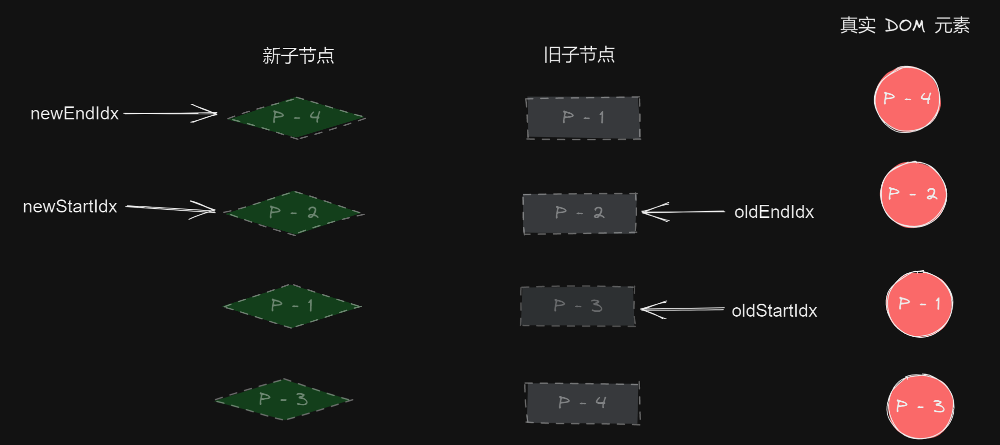

此时，真实 DOM 节点的顺序与新的一组子节点的顺序相同了：p-4、p-2、p-1、p-3。另外，在这一轮更新之后，索引 newStartIdx 和 索引 oldStartIdx 的值都小于 newEndIdx 和 oldEndIdx，所以循环终止，双端 Diff 算法执行完毕。

## 双端 Diff 的优势

理解了双端比较的原理之后，我们来看看与简单的 Diff 算法相对，双端 Diff 算法具有怎样的优势。我们拿之前的例子来看，如下图：


当使用简单 Diff 算法进行更新时，发生了两次 DOM 移动操作：


如果使用双端 Diff 算法来对此例进行更新，会有怎样的表现呢？接下来，我们就以双端比较的思路来完成此例的更新，看一看双端 Diff 算法能否减少 DOM 移动操作次数：


接下来，我们按照双端比较的步骤进行更新：

1. 比较旧的一组子节点中的头部节点 p-1 与新的一组子节点中的头部节点 p-3，两者 key 值不同，不可复用；
2. 比较旧的一组子节点中的尾部节点 p-3 与新的一组子节点中的尾部节点 p-2，两者 key 值不同，不可复用；
3. 比较旧的一组子节点中的头部节点 p-1 与新的一组子节点中的尾部节点 p-2，两者 key 值不同，不可复用；
4. 比较旧的一组子节点中的尾部节点 p-3 与新的一组子节点中的头部节点 p-3，发现可以进行复用。

在第 ④ 步移动操作之后，新旧两组子节点以及真实 DOM 节点的状态如下图：


通过上图我们可以发现，在这一轮比较之后，真实 DOM 节点的顺序已经与新的一组子节点中的顺序一致了。换句话说，我们完成了更新，不过算法仍然会继续执行。开始下一轮比较：

1. 比较旧的一组子节点中的头部节点 p-1 与新的一组子节点中的头部节点 p-1，发现可以复用。由于两者都处于头部，因此不需要移动，只需要打补丁即可。

在这一轮比较之后，新旧两组子节点与真实 DOM 节点的状态如下图所示：


此时，双端 Diff 算法仍然没有停止，开始下一轮比较：

1. 比较旧的一组子节点中的头部节点 p-2 与新的一组子节点中的头部节点 p-2，发现可以复用。由于两者都处于头部，因此不需要移动，只需要打补丁即可。

在这一轮比较过后，新旧两组子节点与真实 DOM 节点的状态如下图所示：


到这一步后，索引 newStartIdx 和 oldStartIdx 的值比索引 newEndIdx 和 oldEndIdx 的值大，于是更新结束。可以看到，对于同样的例子，采用简单的 Diff 算法需要两 DOM 移动操作才能完成更新，而使用双端 Diff 算法只需要一次 DOM 移动操作即可完成更新。

## 非理想状况的处理方式

此前，我们用了一个比较理想例子来讲解双端 Diff 算法。我们知道，双端 Diff 算法的每一轮比较的过程都分为四个步骤。在此前的例子中，每一轮的比较都会命中四个步骤中的一个，这是非常理想的情况。但实际上，并非所有情况都这么理想，如下图所示：

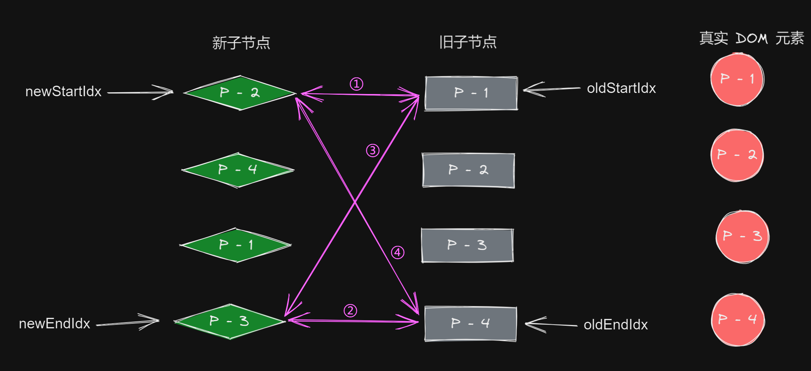

在这个例子中，新旧两组子节点的顺序如下：

+ 旧的一组子节点：p-1、p-2、p-3、p-4；
+ 新的一组子节点：p-2、p-4、p-1、p-3。

当我们尝试按照双端 Diff 算法的思路进行第一轮比较时，会发现无法命中四个步骤中的任何一步，无法找到可复用的节点，应该怎么办呢？

这时，我们只能通过额外的步骤来处理这种非理想情况。**既然两个头部和两个尾部的四个节点中都没有可复用的节点，那么我们就尝试看看非头部、非尾部的节点能否复用。**

具体的做法是，拿新的一组子节点中的头部节点去旧的一组子节点中寻找，如下代码所示：

```js
while (oldStartIdx <= oldEndIdx && newStartIdx <= newEndIdx) {
  if (oldStartVNode.key === newStartVNode.key) {
    // ...
  } else if (oldEndVNode.key === newEndVNode.key) {
    // ...
  } else if (oldStartVNode.key === newEndVNode.key) {
    // ...
  } else if (oldEndVNode.key === newStartVNode.key) {
    // ...
  } else {
    // 遍历旧的一组子节点，试图寻找与 newStartVNode 拥有相同 key 值的节点
    // idxInOld 就是新的一组子节点的头部节点在旧的一组子节点中的索引
    const idxInOld = oldChildren.findIndex(node => node.key === newStartVNode.key)
	}
}
```

在上面的这段代码中，我们遍历旧的一组子节点，尝试在其中寻找与新的一组子节点的头部节点具有相同 key 值的节点，并将该节点在旧的一组子节点中的索引存储到变量 idxInOld 中。这么做的目的是什么呢？想要搞清楚这个问题，我们需要先清楚：**本质上，在旧一的一组子节点中，找到与新的一组子节点的头部节点具有相同 key 值的节点意味着什么？**如下图所示：


观察上图，当我们拿新的一组子节点的头部节点 p-2 去旧的一组子节点中查找时，会在索引为 1 的位置找到可复用的节点。这意味着，节点 p-2 原本不是头部节点，但在更新之后，它应该变成头部节点。所以我们需要将节点 p-2 对应的真实 DOM 节点移动到当前旧的一组子节点的头部节点 p-1 所对应的真实 DOM 节点之前。具体实现如下：

```js
while (oldStartIdx <= oldEndIdx && newStartIdx <= newEndIdx) {
  if (oldStartVNode.key === newStartVNode.key) {
    // ...
  } else if (oldEndVNode.key === newEndVNode.key) {
    // ...
  } else if (oldStartVNode.key === newEndVNode.key) {
    // ...
  } else if (oldEndVNode.key === newStartVNode.key) {
    // ...
  } else {
    // 遍历旧的一组子节点，试图寻找与 newStartVNode 拥有相同 key 值的节点
    // idxInOld 就是新的一组子节点的头部节点在旧的一组子节点中的索引
    const idxInOld = oldChildren.findIndex(node => node.key === newStartVNode.key)

    // idxInOld 大于 0，说明找到了可复用的节点，并且需要将其对应的真实 DOM 移动到头部
    if (idxInOld > 0) {
      // idxInOld 位置对应的 vnode 就是需要移动的节点
      const vnodeToMove = oldChildren[idxInOld]
      // 移动前需要先打补丁
      patch(vnodeToMove, newStartVNode, container)
      // 将 vnodeToMove.el 移动到头部节点 oldStartVNode.el 之前，因此使用后者作为锚点
      insert(vnodeToMove.el, container, oldStartVNode.el)
      // 由于位置 idxInOld 处的节点所对应的真实 DOM 已经移动到了别处，因此将其设置为 undefined
      oldChildren[idxInOld] = undefined
      // 最后更新 nexStartIdx 到下一个位置
      newStartVNode = newChildren[++newStartIdx]
    }
	}
}
```

经过上述操作之后，新旧两组子节点以及真实 DOM 节点的状态如下图所示：

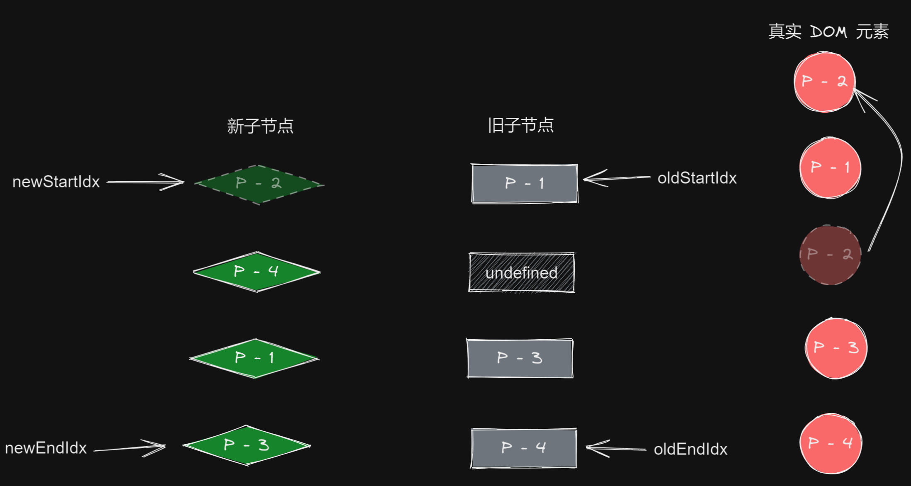

此时，真实 DOM 的顺序为：p-2、p-1、p-3、p-4。接着，双端 Diff 算法会继续进行，如下图所示：

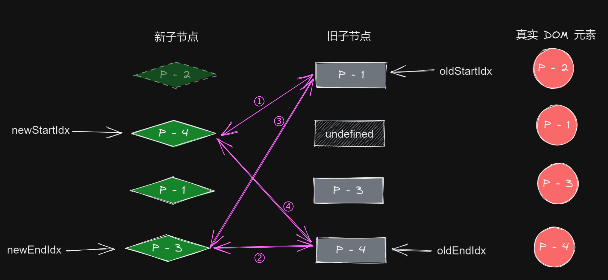

1. 比较旧的一组子节点中的头部节点 p-1 与新的一组子节点中的头部节点 p-4，两者 key 值不同，不可复用；
2. 比较旧的一组子节点中的尾部节点 p-4 与新的一组子节点中的尾部节点 p-3，两者 key 值不同，不可复用；
3. 比较旧的一组子节点中的头部节点 p-1 与新的一组子节点中的尾部节点 p-3，两者 key 值不同，不可复用；
4. 比较旧的一组子节点中的尾部节点 p-4 与新的一组子节点中的头部节点 p-4，两者 key 值相同，可以复用。

在这一轮比较中的第 ④ 步中，我们找到了可复用的节点。因此，按照双端 Diff 算法的逻辑移动真实 DOM，即把节点 p-4 对应的真实 DOM 移动到旧的一组子节点中头部节点 p-1 所对应的真实 DOM 前面，如下图所示：

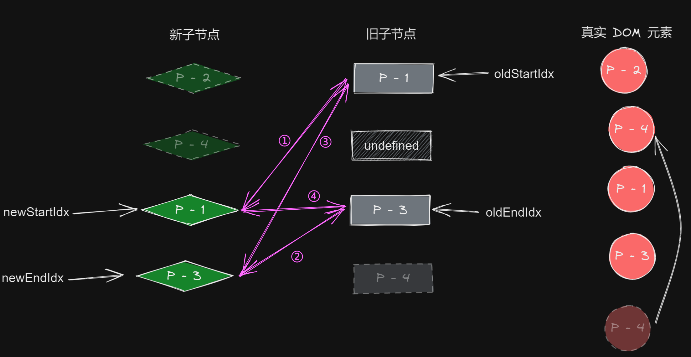

此时，真实 DOM 节点的顺序是：p-2、p-4、p-1、p-3。接着，开始下一轮的比较：

1. 比较旧的一组子节点中的头部节点 p-1 与新的一组子节点中的头部节点 p-1，两者 key 值相同，可以复用。

在这一轮比较中，第 ① 步就找到了可复用的节点。由于两者都处于头部，所以不需要对真实 DOM 进行移动，只需要打补丁即可。在这一步操作之后，新旧两组子节点与真实 DOM 节点的状态如下图所示：

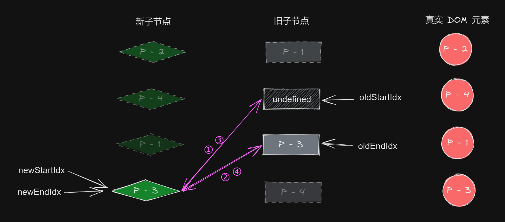

此时，真实 DOM 节点的顺序是：p-2、p-4、p-1、p-3。接着，进行下一轮的比较。需要注意的一点是，此时旧的一组子节点的头部节点是 undefined。这说明该节点已经被处理过了，因此不需要再处理它，直接跳过即可。为此，我们需要补充部分逻辑代码，如下：

```js
while (oldStartIdx <= oldEndIdx && newStartIdx <= newEndIdx) {
  // 增加两个判断分支，如果头尾部节点为 undefined，则说明该节点已经被处理过了，直接跳到下一个位置
  if (!oldStartVNode) {
    oldStartVNode = oldChildren[++oldStartIdx]
  } else if (!oldEndVNode) {
    oldEndVNode = oldChildren[--oldEndIdx]
  } else if (oldStartVNode.key === newStartVNode.key) {
    // ...
  } else if (oldEndVNode.key === newEndVNode.key) {
    // ...
  } else if (oldStartVNode.key === newEndVNode.key) {
    // ...
  } else if (oldEndVNode.key === newStartVNode.key) {
    // ...
  } else {
    // 遍历旧的一组子节点，试图寻找与 newStartVNode 拥有相同 key 值的节点
    // idxInOld 就是新的一组子节点的头部节点在旧的一组子节点中的索引
    const idxInOld = oldChildren.findIndex(node => node.key === newStartVNode.key)

    // idxInOld 大于 0，说明找到了可复用的节点，并且需要将其对应的真实 DOM 移动到头部
    if (idxInOld > 0) {
      // idxInOld 位置对应的 vnode 就是需要移动的节点
      const vnodeToMove = oldChildren[idxInOld]
      // 移动前需要先打补丁
      patch(vnodeToMove, newStartVNode, container)
      // 将 vnodeToMove.el 移动到头部节点 oldStartVNode.el 之前，因此使用后者作为锚点
      insert(vnodeToMove.el, container, oldStartVNode.el)
      // 由于位置 idxInOld 处的节点所对应的真实 DOM 已经移动到了别处，因此将其设置为 undefined
      oldChildren[idxInOld] = undefined
      // 最后更新 nexStartIdx 到下一个位置
      newStartVNode = newChildren[++newStartIdx]
    }
  }
}
```

观察上面的代码，在循环开始时，我们优先判断头部节点和尾部节点是否存在。如果不存在，则说明它们已经被处理过了，直接跳到下一个位置即可。在这一轮比较过后，新旧两组子节点与真实 DOM 节点的状态如下图所示：

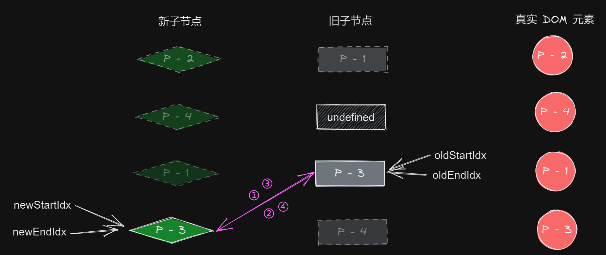

现在，四个步骤又重合了，接着进行最后一轮的比较：

1. 比较旧的一组子节点中的头部节点 p-3 与新的一组子节点中的头部节点 p-3，两者的 key 值相同，可以复用。

在第 ① 步中找到了可复用的节点，由于两者都是头部节点，因此不需要进行 DOM 移动操作，直接打补丁即可。在这一轮比较过后，最终状态如下图所示：

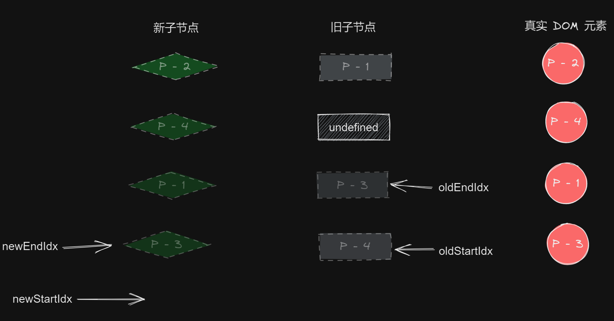

这时，满足循环停止的条件，于是更新完成。最终，真实 DOM 节点的顺序与新的一组子节点的顺序一致：p-2、p-3、p-1、p-3。

## 添加新元素

在之前，我们讲解了非理想情况的处理，即在一轮比较过程中，不会命中四个步骤中的任何一步。这时，我们会拿新的一组子节点中的头部节点去旧的一组子节点中寻找可复用的节点，然而并非总能找到，如下图所示：

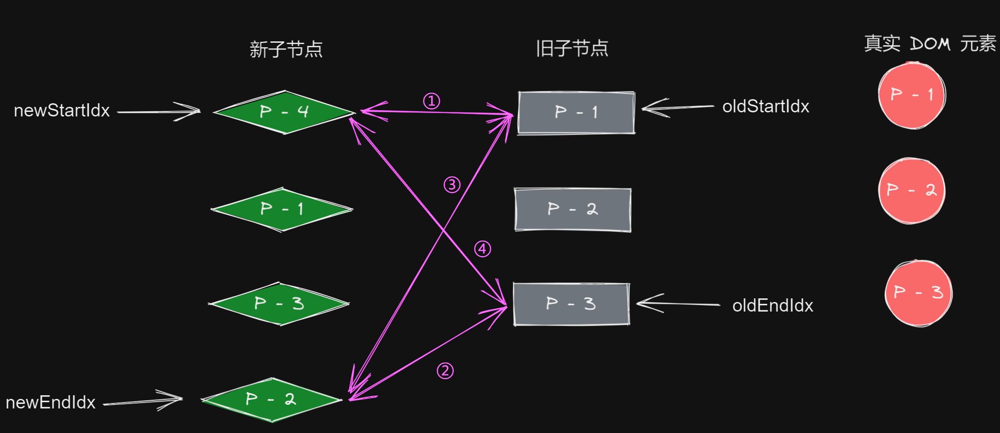

在这个例子中，新旧两组子节点的顺序如下：

+ 旧的一组子节点：p-1、p-2、p-3；
+ 新的一组子节点：p-4、p-1、p-3、p-2。

首先，我们尝试进行第一轮比较，发现在四个步骤的比较中都无法找到可复用的节点；于是我们尝试拿新的一组子节点中的头部节点 p-4 去旧的一组子节点中寻找相同 key 值的节点，但旧的一组子节点中根本没有 p-4，如下图所示：

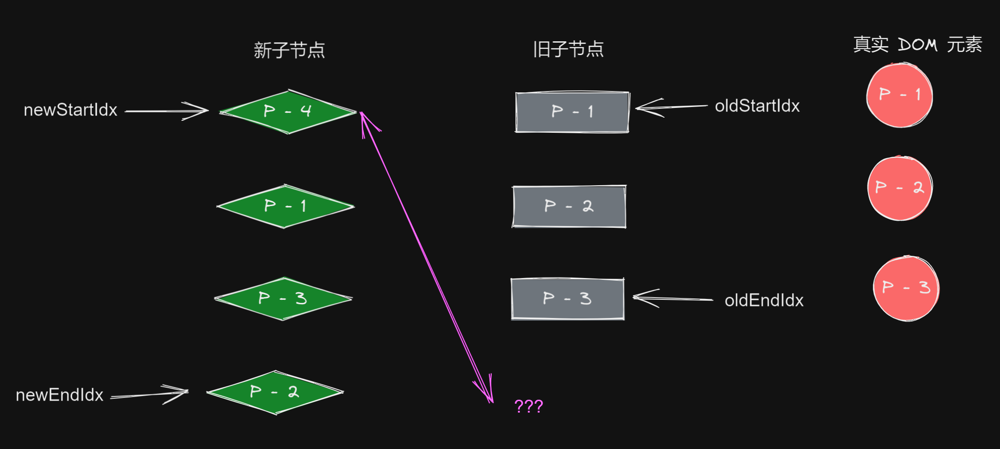

这说明节点 p-4 是一个新增节点，我们应该将它挂载到正确的位置。那么应该挂载到哪里呢？很简单，因为节点 p-4 是新的一组子节点中的头部节点，所以只需要将它挂载到当前头部节点之前即可。“当前”头部节点指的是，旧的一组子节点中的头部节点所对应的真实 DOM 节点 p-1。下面是用来挂载操作的代码：

```js
while (oldStartIdx <= oldEndIdx && newStartIdx <= newEndIdx) {
  // 增加两个判断分支，如果头尾部节点为 undefined，则说明该节点已经被处理过了，直接跳到下一个位置
  if (!oldStartVNode) {
    oldStartVNode = oldChildren[++oldStartIdx]
  } else if (!oldEndVNode) {
    oldEndVNode = oldChildren[--oldEndIdx]
  } else if (oldStartVNode.key === newStartVNode.key) {
    // ...
  } else if (oldEndVNode.key === newEndVNode.key) {
    // ...
  } else if (oldStartVNode.key === newEndVNode.key) {
    // ...
  } else if (oldEndVNode.key === newStartVNode.key) {
    // ...
  } else {
    const idxInOld = oldChildren.findIndex(node => node.key === newStartVNode.key)

    if (idxInOld > 0) {
      const vnodeToMove = oldChildren[idxInOld]
      patch(vnodeToMove, newStartVNode, container)
      insert(vnodeToMove.el, container, oldStartVNode.el)
      oldChildren[idxInOld] = undefined
    } else {
      // 将 newStartVNode 作为新节点挂载到头部，使用当前头部节点 oldStartVNode.el 作为锚点
      patch(null, newStartVNode, container, oldStartVNode.el)
    }
    // 最后更新 nexStartIdx 到下一个位置
    newStartVNode = newChildren[++newStartIdx]
  }
}
```

如上面的代码所示，当条件 idxInOld > 0 不成立时，说明 newStartVNode 节点是全新的节点。又由于 newStartVNode 节点是头部切点，因此我们应该将其作为新的头部节点进行挂载。所以，在调用 `patch()` 函数挂载节点时，我们使用 `oldStartVNode.el` 作为锚点。在这一步操作完成之后，新旧两组子节点以及真实 DOM 的状态如下图所示：


当新节点 p-4 挂载完成后，会进行后续的更新，直到全部更新完成为止。

但这样就完美了吗？我们看另外一个例子，如下图所示：

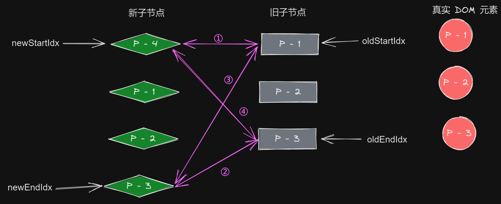

这个例子与上一个例子的不同之前在于，我们调整了新的一组子节点的顺序：p-4、p-1、p-2、p-3。下面我们按照双端 Diff 算法的思路来执行更新，看看会发生什么：

1. 比较旧的一组子节点中的头部节点 p-1 与新的一组子节点中的头部节点 p-4，两者的 key 值不同，不可以复用；
2. 比较旧的一组子节点中的尾部节点 p-3 与新的一组子节点中的尾部节点 p-3，两者的 key 值相同，可以复用。

在第 ② 步中找到了可复用的节点，因此进行更新，更新后的状态如下：

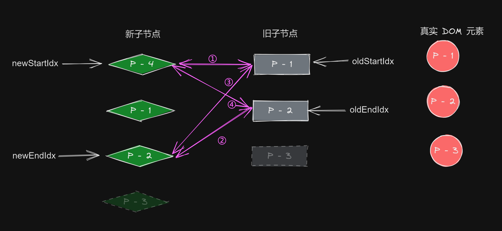

接着进行下一轮比较：

1. 比较旧的一组子节点中的头部节点 p-1 与新的一组子节点中的头部节点 p-4，两者的 key 值不同，不可以复用；
2. 比较旧的一组子节点中的尾部节点 p-2 与新的一组子节点中的尾部节点 p-2，两者的 key 值相同，可以复用。

我们又在第 ② 步中找到了可复用的节点，因此进行更新，更新后的状态如下：


接着进行下一轮更新：

1. 比较旧的一组子节点中的头部节点 p-1 与新的一组子节点中的头部节点 p-4，两者的 key 值不同，不可以复用；
2. 比较旧的一组子节点中的尾部节点 p-1 与新的一组子节点中的尾部节点 p-1，两者的 key 值相同，可以复用。

还是在第 ② 步中找到了可复用的节点，因此进行更新，更新后的状态如下：

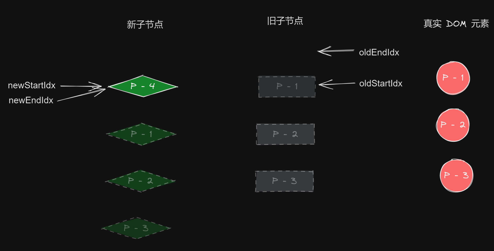

当这一轮更新完毕后，由于变量 oldStartIdx 的值大于 oldEndIdx 的值，满足更新停止的条件，因此更新停止。

但通过观察可知，节点 p-4 在整个更新过程被遗漏了，没有得到任何的处理，这说明我们的算法是有缺陷的。为了弥补这个缺陷，我们需要添加额外的处理代码，如下所示：

```js
function patchKeyedChildren (n1, n2, container) {
  // ...

  while (oldStartIdx <= oldEndIdx && newStartIdx <= newEndIdx) {
    // ...
  }

  // 循环结束后检查索引值的情况
  if (oldEndIdx < oldStartIdx && newStartIdx <= newEndIdx) {
    // 如果满足条件，说明有新的节点遗留，需要挂载它们
    for (let i = newStartIdx; i <= newEndIdx; i++) {
      patch(null, newChildren[i], container, oldStartVNode.el)
    }
  }
}
```

我们在 while 循环结束后增加了一个 if 条件语句，检查四个索引值的情况。根据之前的图示可知，如果条件 `oldEndIdx < oldStartIdx && newStartIdx <= newEndIdx` 成立，说明新的一组子节点中有遗留的节点需要作为新节点挂载。哪些节点是新节点呢？索引值位于 newStartIdx 和 newEndIdx 这个区间内的节点都是新节点。于是我们使用一个 for 循环来遍历这个区间的节点并逐一挂载。挂载时的锚点仍然使用当前的头部节点 `oldStartVNode.el`，这样就完成了对新增元素的处理。

## 移除不存在的元素

解决了新增节点的问题后，我们再来讨论关于移除元素的情况，如下图所示：

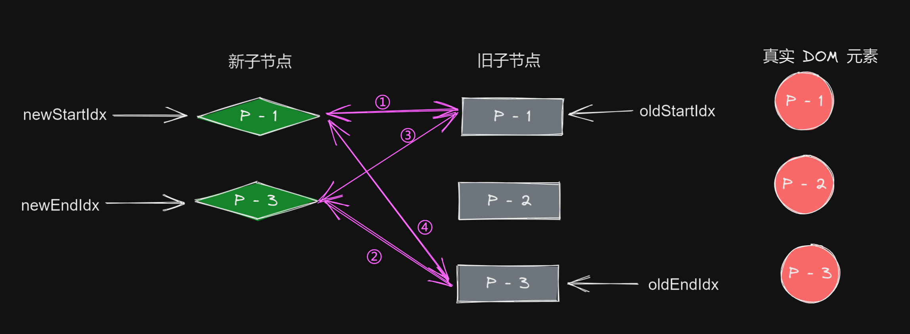

在这个例子中，新旧两组子节点的顺序如下：

+ 旧的一组子节点：p-1、p-2、p-3；
+ 新的一组子节点：p-1、p-3。

可以看到，在新的一组子节点中 p-2 节点已经不存在了。为了搞清楚应该如何处理节点被移除的情况，我们还是按照双端 Diff 算法的思路执行更新：

1. 比较旧的一组子节点的头部节点 p-1 与新的一组子节点的头部节点 p-1，两者的 key 值相同，可以复用。

在第 ① 步中找到了可复用的节点，于是执行更新。在这一轮比较过后，新旧两组子节点以及真实 DOM 节点的状态如下图所示：


接着执行下一轮更新：

1. 比较旧的一组子节点的头部节点 p-2 与新的一组子节点的头部节点 p-3，两者的 key 值不同，不可以复用。
2. 比较旧的一组子节点的尾部节点 p-3 与新的一组子节点的尾部节点 p-3，两者的 key 值相同，可以复用。

在第 ② 步找到了可复用的节点，于是进行更新，在这一轮比较过后，新旧两组子节点以及真实 DOM 节点的状态如下图所示：

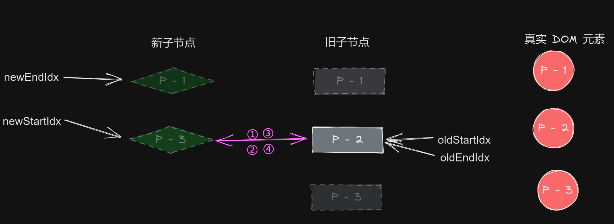

此时变量 newStartIdx 的值大于变量 newEndIdx 的值，满足更新停止的条件，于是更新结束。但从上图可知，旧的一组子节点中存在未被处理的节点，应该将其移除。因此，我们需要增加额外的代码来处理它，如下所示：

```js
function patchKeyedChildren (n1, n2, container) {
  // ...

  while (oldStartIdx <= oldEndIdx && newStartIdx <= newEndIdx) {
    // ...
  }

  // 循环结束后检查索引值的情况
  if (oldEndIdx < oldStartIdx && newStartIdx <= newEndIdx) {
    // ...
  } else if (newEndIdx < newStartIdx && oldStartIdx <= oldEndIdx) {
    // 移除操作
    for (let i = oldStartIdx; i <= oldEndIdx; i++) {
      unmount(oldChildren[i])
    }
  }
}
```

与处理新增节点类似，我们在 while 循环结束后又增加了一个判断分支，用于卸载已经不存在的节点。由上图可知，索引值位于 oldStartIdx 和 oldEndIdx 这个区间内的节点都应该被卸载，于是我们开启一个 for 循环将它们逐一卸载。